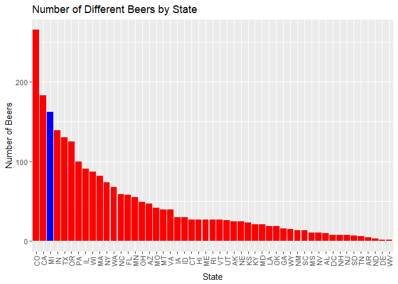
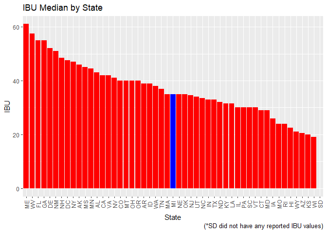

Number of Breweries by State
----------------------------

    # devtools::install_github("krlmlr/here")
    library(here)

    ## here() starts at D:/dataScience/doingDS/case-study01/branches/msds6306Case

    # setwd("C:/Users/Jim/Google Drive/School/DoingDataScience/Proj1")
    local_file1 <- here("data", "Breweries.csv")
    local_file2 <- here("data", "Beers.csv")

    Breweries <- read.csv(paste(local_file1),sep=",", header = TRUE)
    head(Breweries, n=25)

    ##    Brew_ID                         Name          City State
    ## 1        1           NorthGate Brewing    Minneapolis    MN
    ## 2        2    Against the Grain Brewery    Louisville    KY
    ## 3        3     Jack's Abby Craft Lagers    Framingham    MA
    ## 4        4    Mike Hess Brewing Company     San Diego    CA
    ## 5        5      Fort Point Beer Company San Francisco    CA
    ## 6        6        COAST Brewing Company    Charleston    SC
    ## 7        7 Great Divide Brewing Company        Denver    CO
    ## 8        8             Tapistry Brewing      Bridgman    MI
    ## 9        9             Big Lake Brewing       Holland    MI
    ## 10      10   The Mitten Brewing Company  Grand Rapids    MI
    ## 11      11               Brewery Vivant  Grand Rapids    MI
    ## 12      12             Petoskey Brewing      Petoskey    MI
    ## 13      13           Blackrocks Brewery     Marquette    MI
    ## 14      14       Perrin Brewing Company Comstock Park    MI
    ## 15      15  Witch's Hat Brewing Company    South Lyon    MI
    ## 16      16     Founders Brewing Company  Grand Rapids    MI
    ## 17      17            Flat 12 Bierwerks  Indianapolis    IN
    ## 18      18      Tin Man Brewing Company    Evansville    IN
    ## 19      19       Black Acre Brewing Co.  Indianapolis    IN
    ## 20      20            Brew Link Brewing    Plainfield    IN
    ## 21      21           Bare Hands Brewery       Granger    IN
    ## 22      22          Three Pints Brewing  Martinsville    IN
    ## 23      23        Four Fathers Brewing     Valparaiso    IN
    ## 24      24         Indiana City Brewing  Indianapolis    IN
    ## 25      25             Burn 'Em Brewing Michigan City    IN

    library('plyr') # to call the count command

    ## 
    ## Attaching package: 'plyr'

    ## The following object is masked from 'package:here':
    ## 
    ##     here

    States <- (Breweries$State) #assigns variable to States
    count(States) #Generates frequency table.  Number of Observations(breweries)/State

    ##      x freq
    ## 1   AK    7
    ## 2   AL    3
    ## 3   AR    2
    ## 4   AZ   11
    ## 5   CA   39
    ## 6   CO   47
    ## 7   CT    8
    ## 8   DC    1
    ## 9   DE    2
    ## 10  FL   15
    ## 11  GA    7
    ## 12  HI    4
    ## 13  IA    5
    ## 14  ID    5
    ## 15  IL   18
    ## 16  IN   22
    ## 17  KS    3
    ## 18  KY    4
    ## 19  LA    5
    ## 20  MA   23
    ## 21  MD    7
    ## 22  ME    9
    ## 23  MI   32
    ## 24  MN   12
    ## 25  MO    9
    ## 26  MS    2
    ## 27  MT    9
    ## 28  NC   19
    ## 29  ND    1
    ## 30  NE    5
    ## 31  NH    3
    ## 32  NJ    3
    ## 33  NM    4
    ## 34  NV    2
    ## 35  NY   16
    ## 36  OH   15
    ## 37  OK    6
    ## 38  OR   29
    ## 39  PA   25
    ## 40  RI    5
    ## 41  SC    4
    ## 42  SD    1
    ## 43  TN    3
    ## 44  TX   28
    ## 45  UT    4
    ## 46  VA   16
    ## 47  VT   10
    ## 48  WA   23
    ## 49  WI   20
    ## 50  WV    1
    ## 51  WY    4

Unit test for brewery names repeated
------------------------------------

    Breweries <- read.csv(paste(local_file1),sep=",", header = TRUE)
    head(Breweries, n=25)

    ##    Brew_ID                         Name          City State
    ## 1        1           NorthGate Brewing    Minneapolis    MN
    ## 2        2    Against the Grain Brewery    Louisville    KY
    ## 3        3     Jack's Abby Craft Lagers    Framingham    MA
    ## 4        4    Mike Hess Brewing Company     San Diego    CA
    ## 5        5      Fort Point Beer Company San Francisco    CA
    ## 6        6        COAST Brewing Company    Charleston    SC
    ## 7        7 Great Divide Brewing Company        Denver    CO
    ## 8        8             Tapistry Brewing      Bridgman    MI
    ## 9        9             Big Lake Brewing       Holland    MI
    ## 10      10   The Mitten Brewing Company  Grand Rapids    MI
    ## 11      11               Brewery Vivant  Grand Rapids    MI
    ## 12      12             Petoskey Brewing      Petoskey    MI
    ## 13      13           Blackrocks Brewery     Marquette    MI
    ## 14      14       Perrin Brewing Company Comstock Park    MI
    ## 15      15  Witch's Hat Brewing Company    South Lyon    MI
    ## 16      16     Founders Brewing Company  Grand Rapids    MI
    ## 17      17            Flat 12 Bierwerks  Indianapolis    IN
    ## 18      18      Tin Man Brewing Company    Evansville    IN
    ## 19      19       Black Acre Brewing Co.  Indianapolis    IN
    ## 20      20            Brew Link Brewing    Plainfield    IN
    ## 21      21           Bare Hands Brewery       Granger    IN
    ## 22      22          Three Pints Brewing  Martinsville    IN
    ## 23      23        Four Fathers Brewing     Valparaiso    IN
    ## 24      24         Indiana City Brewing  Indianapolis    IN
    ## 25      25             Burn 'Em Brewing Michigan City    IN

    length(unique(States)) #counts unique categories in major_count. 51 States represented

    ## [1] 51

    length(unique(Breweries$Name))

    ## [1] 551

    n_occur <- data.frame(table(Breweries$Name))# gives you a data frame with a list of ids and the number of times they occurred.
    n_occur[n_occur$Freq > 1,]

    ##                        Var1 Freq
    ## 71       Blackrocks Brewery    2
    ## 75    Blue Mountain Brewery    2
    ## 298 Lucette Brewing Company    2
    ## 368     Oskar Blues Brewery    2
    ## 370     Otter Creek Brewing    2
    ## 443 Sly Fox Brewing Company    2
    ## 466  Summit Brewing Company    2

Merged data sets Print first 6 and last 6
-----------------------------------------

    Beers <- read.csv(paste(local_file2),sep=",", header = TRUE)
    mergedData <- merge(Breweries, Beers, by.x=c('Brew_ID'), by.y=c('Brewery_id'))
    head(mergedData,n=6)

    ##   Brew_ID             Name.x        City State        Name.y Beer_ID   ABV
    ## 1       1 NorthGate Brewing  Minneapolis    MN       Pumpion    2689 0.060
    ## 2       1 NorthGate Brewing  Minneapolis    MN    Stronghold    2688 0.060
    ## 3       1 NorthGate Brewing  Minneapolis    MN   Parapet ESB    2687 0.056
    ## 4       1 NorthGate Brewing  Minneapolis    MN  Get Together    2692 0.045
    ## 5       1 NorthGate Brewing  Minneapolis    MN Maggie's Leap    2691 0.049
    ## 6       1 NorthGate Brewing  Minneapolis    MN    Wall's End    2690 0.048
    ##   IBU                               Style Ounces
    ## 1  38                         Pumpkin Ale     16
    ## 2  25                     American Porter     16
    ## 3  47 Extra Special / Strong Bitter (ESB)     16
    ## 4  50                        American IPA     16
    ## 5  26                  Milk / Sweet Stout     16
    ## 6  19                   English Brown Ale     16

    tail(mergedData, n=6)

    ##      Brew_ID                        Name.x          City State
    ## 2405     556         Ukiah Brewing Company         Ukiah    CA
    ## 2406     557       Butternuts Beer and Ale Garrattsville    NY
    ## 2407     557       Butternuts Beer and Ale Garrattsville    NY
    ## 2408     557       Butternuts Beer and Ale Garrattsville    NY
    ## 2409     557       Butternuts Beer and Ale Garrattsville    NY
    ## 2410     558 Sleeping Lady Brewing Company     Anchorage    AK
    ##                         Name.y Beer_ID   ABV IBU                   Style
    ## 2405             Pilsner Ukiah      98 0.055  NA         German Pilsener
    ## 2406         Porkslap Pale Ale      49 0.043  NA American Pale Ale (APA)
    ## 2407           Snapperhead IPA      51 0.068  NA            American IPA
    ## 2408         Moo Thunder Stout      50 0.049  NA      Milk / Sweet Stout
    ## 2409  Heinnieweisse Weissebier      52 0.049  NA              Hefeweizen
    ## 2410 Urban Wilderness Pale Ale      30 0.049  NA        English Pale Ale
    ##      Ounces
    ## 2405     12
    ## 2406     12
    ## 2407     12
    ## 2408     12
    ## 2409     12
    ## 2410     12

Report the number of NA's in each column
----------------------------------------

    summary(mergedData)

    ##     Brew_ID                             Name.x               City     
    ##  Min.   :  1.0   Brewery Vivant            :  62   Grand Rapids:  66  
    ##  1st Qu.: 94.0   Oskar Blues Brewery       :  46   Portland    :  64  
    ##  Median :206.0   Sun King Brewing Company  :  38   Chicago     :  55  
    ##  Mean   :232.7   Cigar City Brewing Company:  25   Indianapolis:  43  
    ##  3rd Qu.:367.0   Sixpoint Craft Ales       :  24   San Diego   :  42  
    ##  Max.   :558.0   Hopworks Urban Brewery    :  23   Boulder     :  41  
    ##                  (Other)                   :2192   (Other)     :2099  
    ##      State                         Name.y        Beer_ID      
    ##   CO    : 265   Nonstop Hef Hop       :  12   Min.   :   1.0  
    ##   CA    : 183   Dale's Pale Ale       :   6   1st Qu.: 808.2  
    ##   MI    : 162   Oktoberfest           :   6   Median :1453.5  
    ##   IN    : 139   Longboard Island Lager:   4   Mean   :1431.1  
    ##   TX    : 130   1327 Pod's ESB        :   3   3rd Qu.:2075.8  
    ##   OR    : 125   Boston Lager          :   3   Max.   :2692.0  
    ##  (Other):1406   (Other)               :2376                   
    ##       ABV               IBU                                    Style     
    ##  Min.   :0.00100   Min.   :  4.00   American IPA                  : 424  
    ##  1st Qu.:0.05000   1st Qu.: 21.00   American Pale Ale (APA)       : 245  
    ##  Median :0.05600   Median : 35.00   American Amber / Red Ale      : 133  
    ##  Mean   :0.05977   Mean   : 42.71   American Blonde Ale           : 108  
    ##  3rd Qu.:0.06700   3rd Qu.: 64.00   American Double / Imperial IPA: 105  
    ##  Max.   :0.12800   Max.   :138.00   American Pale Wheat Ale       :  97  
    ##  NA's   :62        NA's   :1005     (Other)                       :1298  
    ##      Ounces     
    ##  Min.   : 8.40  
    ##  1st Qu.:12.00  
    ##  Median :12.00  
    ##  Mean   :13.59  
    ##  3rd Qu.:16.00  
    ##  Max.   :32.00  
    ## 

IBU has 1005 NA's and ABV has 62 NA's.

FUNCTION BUILDING
-----------------

Create list of States by alphabetical oarder for user to copy into function.
============================================================================

    library('plyr')
    ListOfStates <- sort(unique(mergedData$State))
    ListOfStates <- data.frame(lapply(ListOfStates, as.character), stringsAsFactors=FALSE)
    as.character(ListOfStates)

    ##  [1] " AK" " AL" " AR" " AZ" " CA" " CO" " CT" " DC" " DE" " FL" " GA"
    ## [12] " HI" " IA" " ID" " IL" " IN" " KS" " KY" " LA" " MA" " MD" " ME"
    ## [23] " MI" " MN" " MO" " MS" " MT" " NC" " ND" " NE" " NH" " NJ" " NM"
    ## [34] " NV" " NY" " OH" " OK" " OR" " PA" " RI" " SC" " SD" " TN" " TX"
    ## [45] " UT" " VA" " VT" " WA" " WI" " WV" " WY"

    ListOfStates <- gsub(" ", "", ListOfStates, fixed = TRUE) #Removes extra spaces that area not needed.

Compute the median Alcohol By Volume (ABV) and international bitterness unit (IBU) for each state. Plot a bar chart to compare.
-------------------------------------------------------------------------------------------------------------------------------

    state_ABV <- aggregate(mergedData["ABV"], by=mergedData[c("State")], FUN=median, na.rm=TRUE)
    State_IBU <- aggregate(mergedData["IBU"], by=mergedData[c("State")], FUN=median, na.rm=TRUE)
    ABV_IBU_Output <- merge(state_ABV, State_IBU, by=c('State'))
    ABV_IBU_Output

    ##    State    ABV  IBU
    ## 1     AK 0.0560 46.0
    ## 2     AL 0.0600 43.0
    ## 3     AR 0.0520 39.0
    ## 4     AZ 0.0550 20.5
    ## 5     CA 0.0580 42.0
    ## 6     CO 0.0605 40.0
    ## 7     CT 0.0600 29.0
    ## 8     DC 0.0625 47.5
    ## 9     DE 0.0550 52.0
    ## 10    FL 0.0570 55.0
    ## 11    GA 0.0550 55.0
    ## 12    HI 0.0540 22.5
    ## 13    IA 0.0555 26.0
    ## 14    ID 0.0565 39.0
    ## 15    IL 0.0580 30.0
    ## 16    IN 0.0580 33.0
    ## 17    KS 0.0500 20.0
    ## 18    KY 0.0625 31.5
    ## 19    LA 0.0520 31.5
    ## 20    MA 0.0540 35.0
    ## 21    MD 0.0580 29.0
    ## 22    ME 0.0510 61.0
    ## 23    MI 0.0620 35.0
    ## 24    MN 0.0560 44.5
    ## 25    MO 0.0520 24.0
    ## 26    MS 0.0580 45.0
    ## 27    MT 0.0550 40.0
    ## 28    NC 0.0570 33.5
    ## 29    ND 0.0500 32.0
    ## 30    NE 0.0560 35.0
    ## 31    NH 0.0550 48.5
    ## 32    NJ 0.0460 34.5
    ## 33    NM 0.0620 51.0
    ## 34    NV 0.0600 41.0
    ## 35    NY 0.0550 47.0
    ## 36    OH 0.0580 40.0
    ## 37    OK 0.0600 35.0
    ## 38    OR 0.0560 40.0
    ## 39    PA 0.0570 30.0
    ## 40    RI 0.0550 24.0
    ## 41    SC 0.0550 30.0
    ## 42    SD 0.0600   NA
    ## 43    TN 0.0570 37.0
    ## 44    TX 0.0550 33.0
    ## 45    UT 0.0400 34.0
    ## 46    VA 0.0565 42.0
    ## 47    VT 0.0550 30.0
    ## 48    WA 0.0555 38.0
    ## 49    WI 0.0520 19.0
    ## 50    WV 0.0620 57.5
    ## 51    WY 0.0500 21.0

Compute the number of beers in the state selected. Input State Desired.
-----------------------------------------------------------------------

    StateSelected <- c('MI') #Copy and paste desited state inbetween the quotes here from list of States by alphabetical order.
    StateBeers <- mergedData[grep(StateSelected, mergedData$State),]
    BeersInStateOutput <- paste('There are', length(ListOfStates), ' Unique states in this data set and', nrow(StateBeers), 'unique beers in the state of', StateSelected)
    BeersInStateOutput

    ## [1] "There are 51  Unique states in this data set and 162 unique beers in the state of MI"

    StateBeers

    ##      Brew_ID                           Name.x            City State
    ## 50         8                 Tapistry Brewing        Bridgman    MI
    ## 51         8                 Tapistry Brewing        Bridgman    MI
    ## 52         8                 Tapistry Brewing        Bridgman    MI
    ## 53         9                 Big Lake Brewing         Holland    MI
    ## 54         9                 Big Lake Brewing         Holland    MI
    ## 55        10       The Mitten Brewing Company    Grand Rapids    MI
    ## 56        11                   Brewery Vivant    Grand Rapids    MI
    ## 57        11                   Brewery Vivant    Grand Rapids    MI
    ## 58        11                   Brewery Vivant    Grand Rapids    MI
    ## 59        11                   Brewery Vivant    Grand Rapids    MI
    ## 60        11                   Brewery Vivant    Grand Rapids    MI
    ## 61        11                   Brewery Vivant    Grand Rapids    MI
    ## 62        11                   Brewery Vivant    Grand Rapids    MI
    ## 63        11                   Brewery Vivant    Grand Rapids    MI
    ## 64        11                   Brewery Vivant    Grand Rapids    MI
    ## 65        11                   Brewery Vivant    Grand Rapids    MI
    ## 66        11                   Brewery Vivant    Grand Rapids    MI
    ## 67        11                   Brewery Vivant    Grand Rapids    MI
    ## 68        11                   Brewery Vivant    Grand Rapids    MI
    ## 69        11                   Brewery Vivant    Grand Rapids    MI
    ## 70        11                   Brewery Vivant    Grand Rapids    MI
    ## 71        11                   Brewery Vivant    Grand Rapids    MI
    ## 72        11                   Brewery Vivant    Grand Rapids    MI
    ## 73        11                   Brewery Vivant    Grand Rapids    MI
    ## 74        11                   Brewery Vivant    Grand Rapids    MI
    ## 75        11                   Brewery Vivant    Grand Rapids    MI
    ## 76        11                   Brewery Vivant    Grand Rapids    MI
    ## 77        11                   Brewery Vivant    Grand Rapids    MI
    ## 78        11                   Brewery Vivant    Grand Rapids    MI
    ## 79        11                   Brewery Vivant    Grand Rapids    MI
    ## 80        11                   Brewery Vivant    Grand Rapids    MI
    ## 81        11                   Brewery Vivant    Grand Rapids    MI
    ## 82        11                   Brewery Vivant    Grand Rapids    MI
    ## 83        11                   Brewery Vivant    Grand Rapids    MI
    ## 84        11                   Brewery Vivant    Grand Rapids    MI
    ## 85        11                   Brewery Vivant    Grand Rapids    MI
    ## 86        11                   Brewery Vivant    Grand Rapids    MI
    ## 87        11                   Brewery Vivant    Grand Rapids    MI
    ## 88        11                   Brewery Vivant    Grand Rapids    MI
    ## 89        11                   Brewery Vivant    Grand Rapids    MI
    ## 90        11                   Brewery Vivant    Grand Rapids    MI
    ## 91        11                   Brewery Vivant    Grand Rapids    MI
    ## 92        11                   Brewery Vivant    Grand Rapids    MI
    ## 93        11                   Brewery Vivant    Grand Rapids    MI
    ## 94        11                   Brewery Vivant    Grand Rapids    MI
    ## 95        11                   Brewery Vivant    Grand Rapids    MI
    ## 96        11                   Brewery Vivant    Grand Rapids    MI
    ## 97        11                   Brewery Vivant    Grand Rapids    MI
    ## 98        11                   Brewery Vivant    Grand Rapids    MI
    ## 99        11                   Brewery Vivant    Grand Rapids    MI
    ## 100       11                   Brewery Vivant    Grand Rapids    MI
    ## 101       11                   Brewery Vivant    Grand Rapids    MI
    ## 102       11                   Brewery Vivant    Grand Rapids    MI
    ## 103       11                   Brewery Vivant    Grand Rapids    MI
    ## 104       11                   Brewery Vivant    Grand Rapids    MI
    ## 105       11                   Brewery Vivant    Grand Rapids    MI
    ## 106       11                   Brewery Vivant    Grand Rapids    MI
    ## 107       11                   Brewery Vivant    Grand Rapids    MI
    ## 108       11                   Brewery Vivant    Grand Rapids    MI
    ## 109       11                   Brewery Vivant    Grand Rapids    MI
    ## 110       11                   Brewery Vivant    Grand Rapids    MI
    ## 111       11                   Brewery Vivant    Grand Rapids    MI
    ## 112       11                   Brewery Vivant    Grand Rapids    MI
    ## 113       11                   Brewery Vivant    Grand Rapids    MI
    ## 114       11                   Brewery Vivant    Grand Rapids    MI
    ## 115       11                   Brewery Vivant    Grand Rapids    MI
    ## 116       11                   Brewery Vivant    Grand Rapids    MI
    ## 117       11                   Brewery Vivant    Grand Rapids    MI
    ## 118       12                 Petoskey Brewing        Petoskey    MI
    ## 119       12                 Petoskey Brewing        Petoskey    MI
    ## 120       12                 Petoskey Brewing        Petoskey    MI
    ## 121       12                 Petoskey Brewing        Petoskey    MI
    ## 122       13               Blackrocks Brewery       Marquette    MI
    ## 123       13               Blackrocks Brewery       Marquette    MI
    ## 124       13               Blackrocks Brewery       Marquette    MI
    ## 125       13               Blackrocks Brewery       Marquette    MI
    ## 126       13               Blackrocks Brewery       Marquette    MI
    ## 127       13               Blackrocks Brewery       Marquette    MI
    ## 128       14           Perrin Brewing Company   Comstock Park    MI
    ## 129       14           Perrin Brewing Company   Comstock Park    MI
    ## 130       14           Perrin Brewing Company   Comstock Park    MI
    ## 131       14           Perrin Brewing Company   Comstock Park    MI
    ## 132       14           Perrin Brewing Company   Comstock Park    MI
    ## 133       14           Perrin Brewing Company   Comstock Park    MI
    ## 134       15      Witch's Hat Brewing Company      South Lyon    MI
    ## 135       15      Witch's Hat Brewing Company      South Lyon    MI
    ## 136       16         Founders Brewing Company    Grand Rapids    MI
    ## 137       16         Founders Brewing Company    Grand Rapids    MI
    ## 138       16         Founders Brewing Company    Grand Rapids    MI
    ## 286       40         Gonzo's BiggDogg Brewing       Kalamazoo    MI
    ## 410       60      Latitude 42 Brewing Company         Portage    MI
    ## 411       60      Latitude 42 Brewing Company         Portage    MI
    ## 412       60      Latitude 42 Brewing Company         Portage    MI
    ## 413       60      Latitude 42 Brewing Company         Portage    MI
    ## 479       73                  Atwater Brewery         Detroit    MI
    ## 480       73                  Atwater Brewery         Detroit    MI
    ## 481       73                  Atwater Brewery         Detroit    MI
    ## 482       73                  Atwater Brewery         Detroit    MI
    ## 483       73                  Atwater Brewery         Detroit    MI
    ## 484       73                  Atwater Brewery         Detroit    MI
    ## 502       77                   Bell's Brewery       Kalamazoo    MI
    ## 503       77                   Bell's Brewery       Kalamazoo    MI
    ## 504       77                   Bell's Brewery       Kalamazoo    MI
    ## 505       77                   Bell's Brewery       Kalamazoo    MI
    ## 506       77                   Bell's Brewery       Kalamazoo    MI
    ## 507       77                   Bell's Brewery       Kalamazoo    MI
    ## 568       85         Keweenaw Brewing Company        Houghton    MI
    ## 569       85         Keweenaw Brewing Company        Houghton    MI
    ## 570       85         Keweenaw Brewing Company        Houghton    MI
    ## 571       85         Keweenaw Brewing Company        Houghton    MI
    ## 572       85         Keweenaw Brewing Company        Houghton    MI
    ## 573       85         Keweenaw Brewing Company        Houghton    MI
    ## 574       85         Keweenaw Brewing Company        Houghton    MI
    ## 575       86              Brewery Terra Firma   Traverse City    MI
    ## 716      122        Cheboygan Brewing Company       Cheboygan    MI
    ## 717      122        Cheboygan Brewing Company       Cheboygan    MI
    ## 718      122        Cheboygan Brewing Company       Cheboygan    MI
    ## 724      125     Griffin Claw Brewing Company      Birmingham    MI
    ## 725      125     Griffin Claw Brewing Company      Birmingham    MI
    ## 726      125     Griffin Claw Brewing Company      Birmingham    MI
    ## 727      125     Griffin Claw Brewing Company      Birmingham    MI
    ## 728      125     Griffin Claw Brewing Company      Birmingham    MI
    ## 729      125     Griffin Claw Brewing Company      Birmingham    MI
    ## 730      125     Griffin Claw Brewing Company      Birmingham    MI
    ## 731      125     Griffin Claw Brewing Company      Birmingham    MI
    ## 732      125     Griffin Claw Brewing Company      Birmingham    MI
    ## 826      138 Sietsema Orchards and Cider Mill             Ada    MI
    ## 960      163              Right Brain Brewery   Traverse City    MI
    ## 1118     186               Vander Mill Ciders     Spring Lake    MI
    ## 1119     186               Vander Mill Ciders     Spring Lake    MI
    ## 1120     186               Vander Mill Ciders     Spring Lake    MI
    ## 1121     186               Vander Mill Ciders     Spring Lake    MI
    ## 1122     186               Vander Mill Ciders     Spring Lake    MI
    ## 1123     187                St. Julian Winery         Paw Paw    MI
    ## 1297     230  Rochester Mills Brewing Company       Rochester    MI
    ## 1298     230  Rochester Mills Brewing Company       Rochester    MI
    ## 1299     230  Rochester Mills Brewing Company       Rochester    MI
    ## 1300     230  Rochester Mills Brewing Company       Rochester    MI
    ## 1301     230  Rochester Mills Brewing Company       Rochester    MI
    ## 1302     230  Rochester Mills Brewing Company       Rochester    MI
    ## 1303     230  Rochester Mills Brewing Company       Rochester    MI
    ## 1383     254              Frankenmuth Brewery     Frankenmuth    MI
    ## 1384     254              Frankenmuth Brewery     Frankenmuth    MI
    ## 1385     254              Frankenmuth Brewery     Frankenmuth    MI
    ## 1386     255                 Meckley's Cidery Somerset Center    MI
    ## 1387     255                 Meckley's Cidery Somerset Center    MI
    ## 1388     255                 Meckley's Cidery Somerset Center    MI
    ## 1411     261   Mountain Town Brewing Company   Mount Pleasant    MI
    ## 1706     339  Uncle John's Fruit House Winery      St. John's    MI
    ## 1707     339  Uncle John's Fruit House Winery      St. John's    MI
    ## 1708     339  Uncle John's Fruit House Winery      St. John's    MI
    ## 1966     397      White Flame Brewing Company     Hudsonville    MI
    ## 1972     399        Saugatuck Brewing Company         Douglas    MI
    ## 1982     403  Wolverine State Brewing Company       Ann Arbor    MI
    ## 2087     439          The Right Brain Brewery   Traverse City    MI
    ## 2088     439          The Right Brain Brewery   Traverse City    MI
    ## 2089     439          The Right Brain Brewery   Traverse City    MI
    ## 2094     441          MillKing It Productions       Royal Oak    MI
    ## 2095     441          MillKing It Productions       Royal Oak    MI
    ## 2096     441          MillKing It Productions       Royal Oak    MI
    ## 2380     542          Arcadia Brewing Company    Battle Creek    MI
    ## 2381     542          Arcadia Brewing Company    Battle Creek    MI
    ##                                          Name.y Beer_ID   ABV IBU
    ## 50                                   Mr. Orange    2447 0.057  NA
    ## 51                                      Reactor    2448 0.070  NA
    ## 52                                Peck's Porter    2640 0.065  35
    ## 53                                       Ryecoe    2469 0.062  NA
    ## 54                                    Dark Star    2639 0.080  54
    ## 55   G. B. Russo’s Italian Pistachio Pale Ale    2638 0.052  NA
    ## 56                            Undertaker (2014)    1976 0.067  NA
    ## 57                         Wizard Burial Ground    2137 0.099  NA
    ## 58                                  Smoky Wheat    2101 0.051  NA
    ## 59                                 Pumpkin Tart    1997 0.070  NA
    ## 60                                   Undertaker    1977 0.067  NA
    ## 61                                   Fat Paczki    2382    NA  NA
    ## 62                                     Coq D'Or    1974 0.050  NA
    ## 63                                Pothole Stout    1949 0.063  NA
    ## 64                                        BRIPA    2092 0.062  NA
    ## 65                                 Agent a Deux    1959 0.065  NA
    ## 66                                  Belgian Wit    1958 0.045  NA
    ## 67                                  Moe Lasses'    2006 0.064  NA
    ## 68                                   Root Stock    2466 0.066  NA
    ## 69                                 Black Rabbit    1267 0.050  NA
    ## 70                            Pepper in the Rye    2023 0.063  NA
    ## 71                           Earth-Like Planets    2381    NA  NA
    ## 72                                   Ski Patrol    2290 0.061  NA
    ## 73                                 North French    1973 0.060  NA
    ## 74                                       Kludde     627 0.085  NA
    ## 75                                 Nuit Serpent    2498 0.050  NA
    ## 76                                        Paris    2481 0.090  NA
    ## 77                               The Grand Army    2476 0.055  NA
    ## 78                                 Beach Patrol    2499 0.065  NA
    ## 79                               W.I.P.A Snappa    2086 0.053  NA
    ## 80                                  Star Runner    2636 0.060  NA
    ## 81                         Trebuchet Double IPA    1443 0.093  NA
    ## 82                                Contemplation    1352 0.065  NA
    ## 83                      Tart Side of the Barrel    2598 0.098  NA
    ## 84                                    Farm Hand     387 0.055  NA
    ## 85                                     Solitude     385 0.060  NA
    ## 86                                     Triomphe     384 0.065  NA
    ## 87                              Viking Ice Hole    2241 0.063  NA
    ## 88                                   Rye Porter    2240 0.056  NA
    ## 89                                  Big Red Coq    1044 0.060  NA
    ## 90             Hubris Quadrupel Anniversary Ale    1033 0.099  NA
    ## 91                                         Mela    2091 0.062  NA
    ## 92                                      Belfort    2637 0.067  NA
    ## 93                         Contemplation (2012)     873 0.065  NA
    ## 94                              Acidulated Trip    2467 0.059  NA
    ## 95                           Big Red Coq (2012)     677 0.062  NA
    ## 96                                   Mind Games    2465 0.041  NA
    ## 97                                    Sous Chef    2433 0.082  NA
    ## 98                                 Dubbelicious    2418 0.065  NA
    ## 99                            Cherry Doppelbock    2504 0.065  NA
    ## 100                             Tropical Saison    2500 0.065  NA
    ## 101                       Tart Side of the Moon    1136 0.098  NA
    ## 102                               Vivant Tripel    1178 0.082  NA
    ## 103                              Le Flaneur Ale    1785 0.073  NA
    ## 104     Plow Horse Belgian Style Imperial Stout    1031 0.095  NA
    ## 105                        Escoffier Bretta Ale     909 0.092  NA
    ## 106                                 Tree Bucket    1947 0.093  NA
    ## 107                          Linnaeus Mango IPA    2597 0.060  NA
    ## 108                           Maize & Blueberry    1651 0.056  NA
    ## 109                                      Verdun    2542 0.077  NA
    ## 110                               Zaison (2012)     671 0.090  NA
    ## 111                                      Zaison    1266 0.090  NA
    ## 112                                  Psychopomp    2416 0.062  NA
    ## 113  Vivant Belgian Style Imperial Stout (2012)     860 0.099  NA
    ## 114                        Barrel Aged Triomphe    2541 0.065  NA
    ## 115                        Vivant Tripel (2012)     670 0.092  NA
    ## 116                            Beasts A'Burnin'    2548 0.070  NA
    ## 117                 Trebuchet Double IPA (2012)     669 0.097  NA
    ## 118                                  Horny Monk    1403 0.069  20
    ## 119                               Mind's Eye PA    1402 0.067  74
    ## 120                          North 45 Amber Ale    1404 0.059  25
    ## 121                                     Sparkle    2635 0.041  12
    ## 122                           Coconut Brown Ale    1496 0.068  NA
    ## 123                           North Third Stout    2153 0.060  30
    ## 124                                   Honey Lav    1953 0.052  NA
    ## 125                                   Nordskye     2634 0.048  47
    ## 126                                     51K IPA    1481 0.070  51
    ## 127                               Grand Rabbits    1480 0.055  NA
    ## 128                                       Black    2631 0.058  NA
    ## 129           98 Problems (Cuz A Hop Ain't One)    2630 0.065  65
    ## 130                                Hotbox Brown    2633 0.055  10
    ## 131                              Grapefruit IPA    2628 0.050  35
    ## 132                                        Gold    2632 0.048  15
    ## 133                  Veteran’s Pale Ale (VPA)    2629 0.050  40
    ## 134                     Edward’s Portly Brown    2626 0.045  NA
    ## 135                                Train Hopper    2627 0.058  72
    ## 136                               Dirty Bastard    2625 0.085  50
    ## 137                              Centennial IPA    1565 0.072  65
    ## 138                                 All Day IPA    1223 0.047  42
    ## 286                              Vanilla Porter    2587 0.070  11
    ## 410                               Beach Cruiser    2547 0.045  NA
    ## 411                    10 Degrees of Separation    2491 0.055  NA
    ## 412                                    I.P. Eh!    2493 0.068  NA
    ## 413                           Schoolhouse Honey    2492 0.050  NA
    ## 479                            Grand Circus IPA     528 0.050  62
    ## 480                         Vanilla Java Porter    2502 0.055  12
    ## 481                             Atwater's Lager     527 0.050  12
    ## 482                                   Michelada    2495 0.052  NA
    ## 483                            Dirty Blonde Ale     534 0.045   8
    ## 484                                  Hop A-Peel    2503 0.075 115
    ## 502                                Winter White    2022 0.050  NA
    ## 503                                      Oberon    1989 0.058  NA
    ## 504                                      Oberon    2494 0.058  NA
    ## 505                                     Smitten    2325 0.060  NA
    ## 506                                  Best Brown    1955 0.058  NA
    ## 507                                 Two Hearted    1988 0.070  NA
    ## 568                               U. P. Witbier    2472    NA  NA
    ## 569                  Olde Ore Dock Scottish Ale     364    NA  NA
    ## 570                        Red Jacket Amber Ale      57    NA  NA
    ## 571                      November Gale Pale Ale     779    NA  NA
    ## 572                       Lift Bridge Brown Ale      59    NA  NA
    ## 573                         Pick Axe Blonde Ale      58    NA  NA
    ## 574                       Widow Maker Black Ale      60    NA  NA
    ## 575                               Manitou Amber    2468 0.053  NA
    ## 716                          Blood Orange Honey    2379 0.057  10
    ## 717                                     IPA #11    2380 0.057  58
    ## 718                            Lighthouse Amber    2354 0.052  NA
    ## 724                                Mr. Blue Sky    2375 0.045   6
    ## 725                   Grand Trunk Bohemian Pils    2141 0.050  35
    ## 726                          Norm's Gateway IPA    2007 0.040  55
    ## 727                                  Grind Line    2138 0.050  35
    ## 728                         Screamin’ Pumpkin    2142 0.050  25
    ## 729                                     El Rojo    2140 0.065  25
    ## 730                         Lemon Shandy Tripel    1570 0.090  NA
    ## 731                                  3 Scrooges    2143 0.065  NA
    ## 732                      Norm's Raggedy Ass IPA    2139 0.075  NA
    ## 826                          Sietsema Red Label    2353 0.069  NA
    ## 960                             Smooth Operator    2307 0.038  NA
    ## 1118                                 Hard Apple    1376 0.068  NA
    ## 1119                            Totally Roasted    1378 0.068  NA
    ## 1120                                Nunica Pine    2245 0.068  NA
    ## 1121                                  Blue Gold    1377 0.068  NA
    ## 1122                               Ginger Peach    2244 0.069  NA
    ## 1123                                  Gunga Din    2242 0.052  NA
    ## 1297                          Rochester Red Ale     899 0.059  NA
    ## 1298                          Pine Knob Pilsner    2074 0.053  NA
    ## 1299                            Lazy Daze Lager    1280 0.055  NA
    ## 1300                            Milkshake Stout     363 0.050  NA
    ## 1301            Cal and Co. Black Cherry Porter    1724    NA  NA
    ## 1302                            Lazy Daze Lager      97 0.055  NA
    ## 1303                            Cornerstone IPA     158 0.070  NA
    ## 1383                Twisted Helles Summer Lager    1208 0.055  18
    ## 1384                               Batch 69 IPA    1556 0.069  69
    ## 1385                                Old Detroit    1998 0.056  NA
    ## 1386                                Cherry Bomb    1984 0.069  NA
    ## 1387                          Bushwhacker Cider    1986 0.069  NA
    ## 1388                                Weim-R-Iner    1985 0.069  NA
    ## 1411                                Train Wreck    1952 0.082  NA
    ## 1706            Uncle John's Apple Cherry Cider    1704 0.065  NA
    ## 1707           Uncle John's Apricot Apple Cider    1703 0.065  NA
    ## 1708                   Draught Hard Apple Cider     877 0.065  NA
    ## 1966                                Super G IPA    1498 0.060  NA
    ## 1972                      Oval Beach Blonde Ale    1477 0.050  11
    ## 1982                    Wolverine Premium Lager    1468 0.047  15
    ## 2087                    Northern Hawk Owl Amber    1278 0.058  NA
    ## 2088                        Will Power Pale Ale    1276 0.047  NA
    ## 2089                                  CEO Stout    1277 0.059  NA
    ## 2094                         BRIK Irish Red Ale     365 0.048  NA
    ## 2095                               AXL Pale Ale     273    NA  NA
    ## 2096                              SNO White Ale    1273 0.048  NA
    ## 2380                                    Whitsun     390 0.062  17
    ## 2381                               Sky High Rye     413 0.060  55
    ##                                 Style Ounces
    ## 50                            Witbier     16
    ## 51                       American IPA     16
    ## 52                    American Porter     16
    ## 53                       American IPA     16
    ## 54                     American Stout     16
    ## 55            American Pale Ale (APA)     16
    ## 56                   Belgian Dark Ale     16
    ## 57                   Quadrupel (Quad)     16
    ## 58                          Rauchbier     16
    ## 59             Fruit / Vegetable Beer     16
    ## 60                   Belgian Dark Ale     16
    ## 61                   Belgian Dark Ale     16
    ## 62                   Belgian Pale Ale     16
    ## 63                     American Stout     16
    ## 64                        Belgian IPA     16
    ## 65                   Belgian Dark Ale     16
    ## 66                            Witbier     16
    ## 67                     American Stout     16
    ## 68                           Rye Beer     16
    ## 69                 American Black Ale     16
    ## 70                           Rye Beer     16
    ## 71                   Belgian Pale Ale     16
    ## 72                            Witbier     16
    ## 73                    Bière de Garde     16
    ## 74            Belgian Strong Dark Ale     16
    ## 75                        Belgian IPA     16
    ## 76             Saison / Farmhouse Ale     16
    ## 77                        Belgian IPA     16
    ## 78                            Witbier     16
    ## 79                        Belgian IPA     16
    ## 80                   Belgian Pale Ale     16
    ## 81     American Double / Imperial IPA     16
    ## 82                    Bière de Garde     16
    ## 83   American Double / Imperial Stout     16
    ## 84             Saison / Farmhouse Ale     16
    ## 85                   Belgian Pale Ale     16
    ## 86                        Belgian IPA     16
    ## 87                      Oatmeal Stout     16
    ## 88                    American Porter     16
    ## 89           American Amber / Red Ale     16
    ## 90                   Quadrupel (Quad)     16
    ## 91                   Belgian Dark Ale     16
    ## 92             Saison / Farmhouse Ale     16
    ## 93                    Bière de Garde     16
    ## 94             Saison / Farmhouse Ale     16
    ## 95           American Amber / Red Ale     16
    ## 96                       Dunkelweizen     16
    ## 97            Belgian Strong Pale Ale     16
    ## 98                             Dubbel     16
    ## 99                         Doppelbock     16
    ## 100            Saison / Farmhouse Ale     16
    ## 101                  Belgian Dark Ale     16
    ## 102                            Tripel     16
    ## 103                 American Wild Ale     16
    ## 104  American Double / Imperial Stout     16
    ## 105                 American Wild Ale     16
    ## 106                       Belgian IPA     16
    ## 107                      American IPA     16
    ## 108            Fruit / Vegetable Beer     16
    ## 109                   Bière de Garde     16
    ## 110            Saison / Farmhouse Ale     16
    ## 111            Saison / Farmhouse Ale     16
    ## 112                  Belgian Dark Ale     16
    ## 113            Russian Imperial Stout     16
    ## 114                       Belgian IPA     16
    ## 115                            Tripel     16
    ## 116                         Rauchbier     16
    ## 117                       Belgian IPA     16
    ## 118                            Dubbel     16
    ## 119                      American IPA     16
    ## 120          American Amber / Red Ale     16
    ## 121               American Pale Lager     16
    ## 122                American Brown Ale     12
    ## 123            Foreign / Export Stout     12
    ## 124           American Pale Wheat Ale     12
    ## 125                      American IPA     12
    ## 126                      American IPA     12
    ## 127                         Cream Ale     12
    ## 128                American Black Ale     12
    ## 129                      American IPA     12
    ## 130                American Brown Ale     12
    ## 131                      American IPA     12
    ## 132               American Blonde Ale     12
    ## 133           American Pale Ale (APA)     12
    ## 134                American Brown Ale     12
    ## 135                      American IPA     12
    ## 136            Scotch Ale / Wee Heavy     12
    ## 137                      American IPA     12
    ## 138                      American IPA     12
    ## 286                   American Porter     16
    ## 410                        Hefeweizen     12
    ## 411                 English Brown Ale     12
    ## 412                      American IPA     12
    ## 413          American Amber / Red Ale     12
    ## 479                      American IPA     12
    ## 480                   American Porter     16
    ## 481               Munich Helles Lager     12
    ## 482            Fruit / Vegetable Beer     16
    ## 483               American Blonde Ale     12
    ## 484    American Double / Imperial IPA     16
    ## 502                           Witbier     16
    ## 503           American Pale Wheat Ale     16
    ## 504           American Pale Wheat Ale     12
    ## 505                          Rye Beer     16
    ## 506                American Brown Ale     16
    ## 507                      American IPA     16
    ## 568                           Witbier     12
    ## 569                      Scottish Ale     12
    ## 570          American Amber / Red Ale     12
    ## 571           American Pale Ale (APA)     12
    ## 572                American Brown Ale     12
    ## 573               American Blonde Ale     12
    ## 574                American Brown Ale     12
    ## 575          American Amber / Red Ale     16
    ## 716            Fruit / Vegetable Beer     16
    ## 717                      American IPA     16
    ## 718                           Altbier     16
    ## 724           American Pale Wheat Ale     16
    ## 725                    Czech Pilsener     16
    ## 726                      American IPA     12
    ## 727           American Pale Ale (APA)     16
    ## 728                       Pumpkin Ale     16
    ## 729          American Amber / Red Ale     16
    ## 730                            Tripel     16
    ## 731                     Winter Warmer     16
    ## 732                      American IPA     16
    ## 826                             Cider     16
    ## 960                         Cream Ale     16
    ## 1118                            Cider     16
    ## 1119                            Cider     16
    ## 1120                            Cider     16
    ## 1121                            Cider     16
    ## 1122                            Cider     16
    ## 1123                            Cider     16
    ## 1297         American Amber / Red Ale     16
    ## 1298                   Czech Pilsener     16
    ## 1299           American Adjunct Lager     16
    ## 1300               Milk / Sweet Stout     16
    ## 1301                  American Porter     16
    ## 1302           American Adjunct Lager     12
    ## 1303                     American IPA     16
    ## 1383              Munich Helles Lager     12
    ## 1384                     American IPA     12
    ## 1385         American Amber / Red Ale     12
    ## 1386                            Cider     16
    ## 1387                            Cider     16
    ## 1388                            Cider     16
    ## 1411         American Amber / Red Ale     16
    ## 1706                            Cider     16
    ## 1707                            Cider     16
    ## 1708                            Cider     16
    ## 1966                     American IPA     16
    ## 1972              American Blonde Ale     16
    ## 1982              American Pale Lager     12
    ## 2087         American Amber / Red Ale     12
    ## 2088          American Pale Ale (APA)     16
    ## 2089                   American Stout     16
    ## 2094                    Irish Red Ale     16
    ## 2095          American Pale Ale (APA)     16
    ## 2096                          Witbier     16
    ## 2380          American Pale Wheat Ale     12
    ## 2381          American Pale Ale (APA)     12

Input State desired. Plots ABV and Median IBU with state highlighted
--------------------------------------------------------------------

    #FUNCTION START - UNCOMMENT LATER
    #StateOutput <- function (StateSelected, ListOfStates){
    StateSelected <- c('MI') #Copy and paste desited state inbetween the quotes here from list of States by alphabetical order.
    library('plyr')
    ListOfStates <- sort(unique(mergedData$State))
    ListOfStates #Just a list of the states in alphabetical order assuming it may be needed by the application user.

    ##  [1]  AK  AL  AR  AZ  CA  CO  CT  DC  DE  FL  GA  HI  IA  ID  IL  IN  KS
    ## [18]  KY  LA  MA  MD  ME  MI  MN  MO  MS  MT  NC  ND  NE  NH  NJ  NM  NV
    ## [35]  NY  OH  OK  OR  PA  RI  SC  SD  TN  TX  UT  VA  VT  WA  WI  WV  WY
    ## 51 Levels:  AK  AL  AR  AZ  CA  CO  CT  DC  DE  FL  GA  HI  IA  ID ...  WY

    StateQty <- data.frame(matrix(ncol = 2, nrow = 51)) #Initiates data frame for loop
    ColorOfPlot <- 0 #Initiates vector for loop to be used to color code bar chart.
    library(data.table)
    setnames(StateQty, old = c('X1','X2'), new = c('State','Number')) #Changes the names of columns.

    #  Loop below builds a data frame with state, number of beers in each state, and color scheme for bar chart
    for(i in 1:51){
    StateQty$State[i] <- as.character(ListOfStates[i]) #Adds each state to the vector
    StateBeers <- mergedData[grep(ListOfStates[i], mergedData$State),]
    StateQty$Number[i] <- nrow(StateBeers)
    ColorOfPlot[i] <- 'Red' #Initializes all to the color red.
    }

    StateQty <- StateQty[order(-StateQty$Number),]#Orders from high to low based on number in brewery
    #StateQty
    ColorOfPlot[which(grepl(StateSelected, StateQty$State))] <- 'blue' #Changes the color of the state of interest to stand out in plotting.  Feeds into fill command in plot that follows.
    # Plots a histogram in decreasing order of beers per state with the state of interest highlighted
    library(ggplot2)
    ggplot(data=StateQty, aes(x=reorder(State, -Number), y=Number)) + geom_bar(stat = "identity", fill=ColorOfPlot) +  theme(axis.text.x=element_text(angle=90,vjust=0.5)) + xlab("State") + ylab("Number of Beers") + ggtitle("Number of Different Beers by State")

    # Loop to construct the color scheme for fill option in plotting median IBU by state
    ColorOfPlotIBU <- 0
    for(i in 1:51){
    ColorOfPlotIBU[i] <- 'Red'
    }
    State_IBU <- State_IBU[order(-State_IBU$IBU),]#Orders from high to low based on IBU
    State_IBU[is.na(State_IBU)] <- 0
    ColorOfPlotIBU[which(grepl(StateSelected, State_IBU$State))] <- 'blue' 
    ggplot(data=State_IBU, aes(x=reorder(State, -IBU), y=IBU)) + geom_bar(stat = "identity", fill=ColorOfPlotIBU) +  theme(axis.text.x=element_text(angle=90,vjust=0.5)) + xlab("State") + ylab("IBU") + ggtitle("IBU Median by State") + labs(caption = "(*SD did not have any reported IBU values)")

    # }  function end. uncomment later.

    # Function Setup and inputs
    #StateReport <- function(StateOfInterest, Filename) {
    #FileToRead <- paste(getwd(), '/', Filename, sep="")
    #FileToRead
    #SleepData <- read.csv(FileToRead)

    # 3a. Create Objects
    #MedianAge <- median(SleepData$Age, na.rm=TRUE) #Median Age Object
    #MinDurationSleep <- min(SleepData$Duration, na.rm=TRUE) #Min Sleep Object
    #MaxDurationSleep <- max(SleepData$Duration, na.rm=TRUE) # Max Sleep object
    #MeanRSES <- mean(SleepData$RSES, na.rm=TRUE) # Mean RSES Object
    #StdDevRSES <- sd(SleepData$RSES, na.rm=TRUE) # Standard Deviation of RSES Object
    #SumObjects <- c(MedianAge, MinDurationSleep, MaxDurationSleep, MeanRSES, StdDevRSES)
    #SumObjects #Creates one vector with all of the values.

    #3b. Create a data.frame
    #report <- data.frame(MedianAge, MeanRSES/5, StdDevRSES/5, MaxDurationSleep - MinDurationSleep) # creates data frame with the requested data for question 3b.
    #report

    #3c. Change the column names
    #cnames <- c("MedianAge", "SelfEsteem", "SE_SD", "DurationRange")
    #colnames(report) <- cnames
    #report

    #3d. Round the report to at most 2 digits
    #report$SelfEsteem <- round(report$SelfEsteem, digits = 2)
    #report$SE_SD <- round(report$SE_SD, digits = 2)
    #report
    #}

3e Run Function

    #setwd("c:/Users/Jim/Google Drive/school/DoingD~1/Week3")
    #Filename <- c('sleep_data_01.csv')
    #SummaryReport(Filename)
