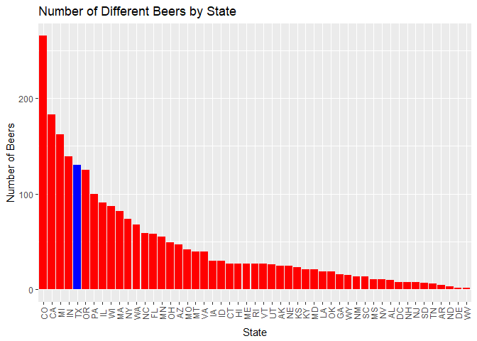
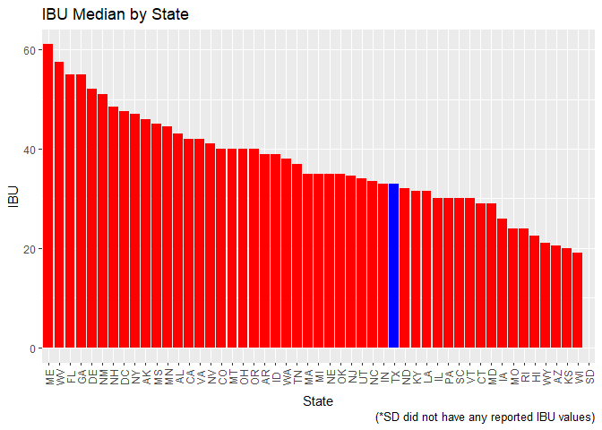

INTRODUCTION
============

The number of breweries in the United States has more than tripled in
the last decade according to www.brewersassociation.org. Along with this
explosive growth the industry is becoming much more competitive. For
startup breweries it is important to understand the level of competition
within the state and the preferences of the consumer in order to be
successful. BrewData Inc., a data science company specializing in
brewery and beer data, is pleased to provide our client, Great-Beer
Distributors Inc. (GBDI), with an easy to use R program which reports
out specific beer and brewery data of interested by the state as well as
national trends. As requested BrewData Inc. will conduct this work
utilizing the data provided by GBDI. Finally, GBDI has also asked
BrewDAta Inc. to simplify the data provided by consolidating in to one
merged data file and to identify missing data.

CAPABILITIES AND DEMONSTRATION OF PROGRAM To illustrate the program
capabilites BrewData Inc. has provided the following sample program
output. All all that is needed is to enter the state in the indicated
location and the program will provide a report specific to the state
entered. A sample report for the state of Michigan, entered as 'MI', is
provided below.

TODO:File reference still required in bibliography. TODO: Clear explicit
answers to all questions.

Once the state is entered the program will output the following useful
information:

1.  Number of Breweries in each state. This provides national context.

<!-- -->

    StateSelected <- params$state
    #tateSelected <- c('MI') #Fill in desired state inbetween the quotes here from list of States by alphabetical order.
    # devtools::install_github("krlmlr/here")
    library(here)

    ## here() starts at C:/Users/Jim/Google Drive/School/DoingDataScience/BranchProject/msds6306Case

    local_file1 <- here("data", "Breweries.csv")
    local_file2 <- here("data", "Beers.csv")
    Breweries <- read.csv(paste(local_file1),sep=",", header = TRUE)
    library('plyr') # to call the count command

    ## 
    ## Attaching package: 'plyr'

    ## The following object is masked from 'package:here':
    ## 
    ##     here

    States <- (Breweries$State) #assigns variable to States
    names(States)[names(States) == "x"] <- "State"
    names(States)[names(States) == "freq"] <- "frequency"
    count(States) #Generates frequency table.  Number of Observations(breweries)/State

    ##      x freq
    ## 1   AK    7
    ## 2   AL    3
    ## 3   AR    2
    ## 4   AZ   11
    ## 5   CA   39
    ## 6   CO   47
    ## 7   CT    8
    ## 8   DC    1
    ## 9   DE    2
    ## 10  FL   15
    ## 11  GA    7
    ## 12  HI    4
    ## 13  IA    5
    ## 14  ID    5
    ## 15  IL   18
    ## 16  IN   22
    ## 17  KS    3
    ## 18  KY    4
    ## 19  LA    5
    ## 20  MA   23
    ## 21  MD    7
    ## 22  ME    9
    ## 23  MI   32
    ## 24  MN   12
    ## 25  MO    9
    ## 26  MS    2
    ## 27  MT    9
    ## 28  NC   19
    ## 29  ND    1
    ## 30  NE    5
    ## 31  NH    3
    ## 32  NJ    3
    ## 33  NM    4
    ## 34  NV    2
    ## 35  NY   16
    ## 36  OH   15
    ## 37  OK    6
    ## 38  OR   29
    ## 39  PA   25
    ## 40  RI    5
    ## 41  SC    4
    ## 42  SD    1
    ## 43  TN    3
    ## 44  TX   28
    ## 45  UT    4
    ## 46  VA   16
    ## 47  VT   10
    ## 48  WA   23
    ## 49  WI   20
    ## 50  WV    1
    ## 51  WY    4

1.  Merge beer data with Breweries data and consolidate into
    one document. A printing of the first 6 observations and the last 6
    observations are provided here as a sample of the output.

<!-- -->

    Beers <- read.csv(paste(local_file2),sep=",", header = TRUE)
    mergedData <- merge(Breweries, Beers, by.x=c('Brew_ID'), by.y=c('Brewery_id'))
    names(mergedData)[names(mergedData) == "Name.x"] <- "Brewery_Name"
    names(mergedData)[names(mergedData) == "Name.y"] <- "Beer_Name"
    head(mergedData,n=6)

    ##   Brew_ID       Brewery_Name        City State     Beer_Name Beer_ID   ABV
    ## 1       1 NorthGate Brewing  Minneapolis    MN       Pumpion    2689 0.060
    ## 2       1 NorthGate Brewing  Minneapolis    MN    Stronghold    2688 0.060
    ## 3       1 NorthGate Brewing  Minneapolis    MN   Parapet ESB    2687 0.056
    ## 4       1 NorthGate Brewing  Minneapolis    MN  Get Together    2692 0.045
    ## 5       1 NorthGate Brewing  Minneapolis    MN Maggie's Leap    2691 0.049
    ## 6       1 NorthGate Brewing  Minneapolis    MN    Wall's End    2690 0.048
    ##   IBU                               Style Ounces
    ## 1  38                         Pumpkin Ale     16
    ## 2  25                     American Porter     16
    ## 3  47 Extra Special / Strong Bitter (ESB)     16
    ## 4  50                        American IPA     16
    ## 5  26                  Milk / Sweet Stout     16
    ## 6  19                   English Brown Ale     16

    tail(mergedData, n=6)

    ##      Brew_ID                  Brewery_Name          City State
    ## 2405     556         Ukiah Brewing Company         Ukiah    CA
    ## 2406     557       Butternuts Beer and Ale Garrattsville    NY
    ## 2407     557       Butternuts Beer and Ale Garrattsville    NY
    ## 2408     557       Butternuts Beer and Ale Garrattsville    NY
    ## 2409     557       Butternuts Beer and Ale Garrattsville    NY
    ## 2410     558 Sleeping Lady Brewing Company     Anchorage    AK
    ##                      Beer_Name Beer_ID   ABV IBU                   Style
    ## 2405             Pilsner Ukiah      98 0.055  NA         German Pilsener
    ## 2406         Porkslap Pale Ale      49 0.043  NA American Pale Ale (APA)
    ## 2407           Snapperhead IPA      51 0.068  NA            American IPA
    ## 2408         Moo Thunder Stout      50 0.049  NA      Milk / Sweet Stout
    ## 2409  Heinnieweisse Weissebier      52 0.049  NA              Hefeweizen
    ## 2410 Urban Wilderness Pale Ale      30 0.049  NA        English Pale Ale
    ##      Ounces
    ## 2405     12
    ## 2406     12
    ## 2407     12
    ## 2408     12
    ## 2409     12
    ## 2410     12

1.  Identification of missing data. In this output missing data will be
    represented by an "NA" term.

<!-- -->

    # report number of NAs
    num_NAs <- sapply(mergedData, function(x) sum(is.na(x)))
    num_NAs

    ##      Brew_ID Brewery_Name         City        State    Beer_Name 
    ##            0            0            0            0            0 
    ##      Beer_ID          ABV          IBU        Style       Ounces 
    ##            0           62         1005            0            0

1.  Compute the median Alcohol By Volume content (ABV) and the
    International Bitterness Unite (IBU) for each state.

<!-- -->

    state_ABV <- aggregate(mergedData["ABV"], by=mergedData[c("State")], FUN=median, na.rm=TRUE)
    State_IBU <- aggregate(mergedData["IBU"], by=mergedData[c("State")], FUN=median, na.rm=TRUE)
    library('plyr')
    ListOfStates <- sort(unique(mergedData$State)) # Creates a list of the states in alphabetical order assuming it may be needed by the application user.
    StateQty <- data.frame(matrix(ncol = 2, nrow = 51)) #Initiates data frame for loop
    ColorOfPlot <- 0 #Initiates vector for loop to be used to color code bar chart.
    library(data.table)
    setnames(StateQty, old = c('X1','X2'), new = c('State','Number')) #Changes the names of columns.

    #  Loop below builds a data frame with state, number of beers in each state, and color scheme for bar chart
    for(i in 1:51){
    StateQty$State[i] <- as.character(ListOfStates[i]) #Adds each state to the vector
    StateBeers <- mergedData[grep(ListOfStates[i], mergedData$State),]
    StateQty$Number[i] <- nrow(StateBeers)
    ColorOfPlot[i] <- 'Red' #Initializes all to the color red.
    }

    StateQty <- StateQty[order(-StateQty$Number),]#Orders from high to low based on number in brewery
    #StateQty
    ColorOfPlot[which(grepl(StateSelected, StateQty$State))] <- 'blue' #Changes the color of the state of interest to stand out in plotting.  Feeds into fill command in plot that follows.
    # Plots a histogram in decreasing order of beers per state with the state of interest highlighted
    library(ggplot2)
    ggplot(data=StateQty, aes(x=reorder(State, -Number), y=Number)) + geom_bar(stat = "identity", fill=ColorOfPlot) +  theme(axis.text.x=element_text(angle=90,vjust=0.5)) + xlab("State") + ylab("Number of Beers") + ggtitle("Number of Different Beers by State")

    # Loop to construct the color scheme for fill option in plotting median IBU by state
    ColorOfPlotIBU <- 0
    for(i in 1:51){
    ColorOfPlotIBU[i] <- 'Red'
    }
    State_IBU <- State_IBU[order(-State_IBU$IBU),]#Orders from high to low based on IBU
    State_IBU[is.na(State_IBU)] <- 0
    ColorOfPlotIBU[which(grepl(StateSelected, State_IBU$State))] <- 'blue' 
    ggplot(data=State_IBU, aes(x=reorder(State, -IBU), y=IBU)) + geom_bar(stat = "identity", fill=ColorOfPlotIBU) +  theme(axis.text.x=element_text(angle=90,vjust=0.5)) + xlab("State") + ylab("IBU") + ggtitle("IBU Median by State") + labs(caption = "(*SD did not have any reported IBU values)")

1.  Which state has the maximum alcoholic (ABV) beer? Which state has
    the most bitter (IBU) beer? The state with the highest (max) median
    ABV is District of Columbia (DC). The state with the highest (max)
    median IBU is Maine (ME).

<!-- -->

    # max ABV
    state_ABV[which.max(state_ABV$ABV),]

    ##   State    ABV
    ## 8    DC 0.0625

    # max IBU
    State_IBU[which.max(State_IBU$IBU),]

    ##    State IBU
    ## 22    ME  61

1.  Summary statistics for the ABV variable. TODO: Add description of
    how this fits the report.

<!-- -->

    summary(state_ABV)

    ##      State         ABV         
    ##   AK    : 1   Min.   :0.04000  
    ##   AL    : 1   1st Qu.:0.05500  
    ##   AR    : 1   Median :0.05600  
    ##   AZ    : 1   Mean   :0.05585  
    ##   CA    : 1   3rd Qu.:0.05800  
    ##   CO    : 1   Max.   :0.06250  
    ##  (Other):45

1.  Is there an apparent relationship between the bitterness of the beer
    and its alcoholic content? Draw a scatter plot. TODO:How do we want
    to describe this trend?

<!-- -->

    ggplot(mergedData, aes(x = IBU, y = ABV)) + 
      geom_point(colour = 'red', size = 1, na.rm=TRUE) + 
      labs(title = "Relationship between Bitterness and Alcohol content", subtitle = "Is bitter better?") + 
      labs(caption = "(based on data from ...?? where's the data from ??)") +
      geom_smooth(method=lm, se=FALSE, size = 1, na.rm=TRUE)

8.TODO: Add in if we have time. Number of different beers in each state
highlighting how the selected state compares. This provides insight into
the level of competition in your state as well as an indication which
states are "Brew Friendly."

9.TODO: Add in if we have time. Number of beers in your state by style.
Are there too many Pilsners already in your state?

\*\*\*\*\*\*\*\*\*\*\*\*\*\*\*\*\*\*Should we add any more? (MAY DEPEND ON AVAIALBLE TIME) \*\*\*\*\*\*\*\*\*\*\*\*\*\*\*\*\*\*\*\*\*\*\*\*\*\*\*\*\*\*\*\*\*\*\*\*\*\*\*\*\*\*\*\*\*\*\*\*\*\*
===============================================================================================================================================================================================

TODO: CONCLUSION (Decide what to say in the conclusion and if we need to
add any more code.)
