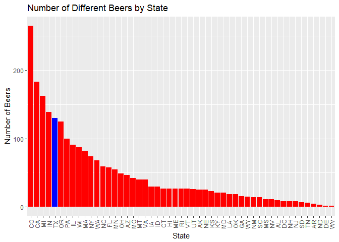
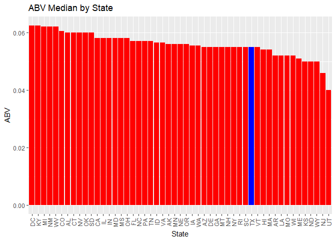

# Case Study 01 - Beers
Randall Hendrickson and Jim Park  
October 6, 2017  

# INTRODUCTION

The number of breweries in the United States has more than tripled in the last decade according to www.brewersassociation.org.  Along with this explosive growth the industry is becoming much more competitive.   For startup breweries it is important to understand the level of competition within the state and the preferences of the consumer in order to be successful.  BrewData Inc., a data science company specializing in brewery and beer data, is pleased to provide our client, Great-Beer Distributors Inc. (GBDI), with an easy to use R program which reports out specific beer and brewery data of interested by the state as well as national trends.  As requested BrewData Inc. will conduct this work utilizing the data provided by GBDI.  Finally, GBDI has also asked BrewDAta Inc. to simplify the data provided by consolidating in to one merged data file and to identify missing data.

# CAPABILITIES AND DEMONSTRATION OF PROGRAM
To illustrate the program capabilites BrewData Inc. has provided sample program output using the state of Texas. To get additional reports for different states, change the state in *line 6* of the *Master_JP_RH.Rmd* document to another state, and run the *make* command at the project root directory, or use RStudio's *Build All* button. The program will provide a report specific to the state entered.  A sample report for the state of Texas, entered as 'TX', is provided below.

Here are specific responses as requested by our contract signed earlier. Please note, for the purpose of this report,  Washington D.C is modeled as a separate state.

1. As requested by GBDI, we have the following data for the number of breweries in each state. This will provide data whether their new brewery has local competition and by how many breweries.


```r
StateSelected <- params$state
# devtools::install_github("krlmlr/here")
library(here)
```

```
## here() starts at C:/Users/Jim/Google Drive/School/DoingDataScience/BranchProject/msds6306Case
```

```r
local_file1 <- here("data", "Breweries.csv")
local_file2 <- here("data", "Beers.csv")
Breweries <- read.csv(paste(local_file1),sep=",", header = TRUE)
library('plyr') # to call the count command
```

```
## 
## Attaching package: 'plyr'
```

```
## The following object is masked from 'package:here':
## 
##     here
```

```r
States <- (Breweries$State) #assigns variable to States
count(States) #Generates frequency table.  Number of Observations(breweries)/State
```

```
##      x freq
## 1   AK    7
## 2   AL    3
## 3   AR    2
## 4   AZ   11
## 5   CA   39
## 6   CO   47
## 7   CT    8
## 8   DC    1
## 9   DE    2
## 10  FL   15
## 11  GA    7
## 12  HI    4
## 13  IA    5
## 14  ID    5
## 15  IL   18
## 16  IN   22
## 17  KS    3
## 18  KY    4
## 19  LA    5
## 20  MA   23
## 21  MD    7
## 22  ME    9
## 23  MI   32
## 24  MN   12
## 25  MO    9
## 26  MS    2
## 27  MT    9
## 28  NC   19
## 29  ND    1
## 30  NE    5
## 31  NH    3
## 32  NJ    3
## 33  NM    4
## 34  NV    2
## 35  NY   16
## 36  OH   15
## 37  OK    6
## 38  OR   29
## 39  PA   25
## 40  RI    5
## 41  SC    4
## 42  SD    1
## 43  TN    3
## 44  TX   28
## 45  UT    4
## 46  VA   16
## 47  VT   10
## 48  WA   23
## 49  WI   20
## 50  WV    1
## 51  WY    4
```

2. Additional information requested by GBDI was related to the beers that these respective brewers produce. We have consolidated this data by merging the data for the beers produced by each brewer. As requested, here are the first and last six observations for this data. A printing of the first 6 observations and the last 6 observations are provided here as a sample of the output.


```r
Beers <- read.csv(paste(local_file2),sep=",", header = TRUE)
mergedData <- merge(Breweries, Beers, by.x=c('Brew_ID'), by.y=c('Brewery_id'))
names(mergedData)[names(mergedData) == "Name.x"] <- "Brewery_Name"
names(mergedData)[names(mergedData) == "Name.y"] <- "Beer_Name"
mergedData$State <- gsub(" ", "", mergedData$State, fixed = TRUE) #Removes extra spaces that area not needed.
head(mergedData,n=6)
```

```
##   Brew_ID       Brewery_Name        City State     Beer_Name Beer_ID   ABV
## 1       1 NorthGate Brewing  Minneapolis    MN       Pumpion    2689 0.060
## 2       1 NorthGate Brewing  Minneapolis    MN    Stronghold    2688 0.060
## 3       1 NorthGate Brewing  Minneapolis    MN   Parapet ESB    2687 0.056
## 4       1 NorthGate Brewing  Minneapolis    MN  Get Together    2692 0.045
## 5       1 NorthGate Brewing  Minneapolis    MN Maggie's Leap    2691 0.049
## 6       1 NorthGate Brewing  Minneapolis    MN    Wall's End    2690 0.048
##   IBU                               Style Ounces
## 1  38                         Pumpkin Ale     16
## 2  25                     American Porter     16
## 3  47 Extra Special / Strong Bitter (ESB)     16
## 4  50                        American IPA     16
## 5  26                  Milk / Sweet Stout     16
## 6  19                   English Brown Ale     16
```

```r
tail(mergedData, n=6)
```

```
##      Brew_ID                  Brewery_Name          City State
## 2405     556         Ukiah Brewing Company         Ukiah    CA
## 2406     557       Butternuts Beer and Ale Garrattsville    NY
## 2407     557       Butternuts Beer and Ale Garrattsville    NY
## 2408     557       Butternuts Beer and Ale Garrattsville    NY
## 2409     557       Butternuts Beer and Ale Garrattsville    NY
## 2410     558 Sleeping Lady Brewing Company     Anchorage    AK
##                      Beer_Name Beer_ID   ABV IBU                   Style
## 2405             Pilsner Ukiah      98 0.055  NA         German Pilsener
## 2406         Porkslap Pale Ale      49 0.043  NA American Pale Ale (APA)
## 2407           Snapperhead IPA      51 0.068  NA            American IPA
## 2408         Moo Thunder Stout      50 0.049  NA      Milk / Sweet Stout
## 2409  Heinnieweisse Weissebier      52 0.049  NA              Hefeweizen
## 2410 Urban Wilderness Pale Ale      30 0.049  NA        English Pale Ale
##      Ounces
## 2405     12
## 2406     12
## 2407     12
## 2408     12
## 2409     12
## 2410     12
```

3. As requested by GBDI, we are pleased to perform robustness tests on the produced data. We have identified some missing data as detailed below. This is represented by an "NA" term and the counts are detailed below. The chart below shows there are 62 NAs in Alcohol by Volume (ABV) and there are 1005 NAs in International Bitterness Unit data. Both were from data sets provided by GBDI. It should be noted that South Dakota did not have any reported IBU data. (For an additional fee, we can provide testing for all missing NA data or provide state of the art bootstrapping techniques.)


```r
# report number of NAs
num_NAs <- sapply(mergedData, function(x) sum(is.na(x)))
num_NAs
```

```
##      Brew_ID Brewery_Name         City        State    Beer_Name 
##            0            0            0            0            0 
##      Beer_ID          ABV          IBU        Style       Ounces 
##            0           62         1005            0            0
```

4. After speaking with GBDI's *Brewmaster Mr. Potterhead*, we are well aware of the need to understand the ABV and IBU medians from the provided data. We are pleased to provide *Mr. Potterhead* with the following results and he should note that the report is customized to highlight The State of Texas in *Blue* as defined in our contract.  In addition we have provided a chart including the number of beers per state.


```r
state_ABV <- aggregate(mergedData["ABV"], by=mergedData[c("State")], FUN=median, na.rm=TRUE)
State_IBU <- aggregate(mergedData["IBU"], by=mergedData[c("State")], FUN=median, na.rm=TRUE)
library('plyr')
ListOfStates <- sort(unique(mergedData$State)) # Creates a list of the states in alphabetical order assuming it may be needed by the application user.
StateQty <- data.frame(matrix(ncol = 2, nrow = 51)) #Initiates data frame for loop
ColorOfPlot <- 0 #Initiates vector for loop to be used to color code bar chart.
library(data.table)
setnames(StateQty, old = c('X1','X2'), new = c('State','Number')) #Changes the names of columns.

#  Loop below builds a data frame with state, number of beers in each state, and color scheme for bar chart
for(i in 1:51){
StateQty$State[i] <- as.character(ListOfStates[i]) #Adds each state to the vector
StateBeers <- mergedData[grep(ListOfStates[i], mergedData$State),]
StateQty$Number[i] <- nrow(StateBeers)
ColorOfPlot[i] <- 'Red' #Initializes all to the color red.
}

StateQty <- StateQty[order(-StateQty$Number),]#Orders from high to low based on number in brewery
#StateQty
ColorOfPlot[which(grepl(StateSelected, StateQty$State))] <- 'blue' #Changes the color of the state of interest to stand out in plotting.  Feeds into fill command in plot that follows.
# Plots a histogram in decreasing order of beers per state with the state of interest highlighted
library(ggplot2)
ggplot(data=StateQty, aes(x=reorder(State, -Number), y=Number)) + geom_bar(stat = "identity", fill=ColorOfPlot) +  theme(axis.text.x=element_text(angle=90,vjust=0.5)) + xlab("State") + ylab("Number of Beers") + ggtitle("Number of Different Beers by State")
```

<!-- -->

```r
# Loop to construct the color scheme for fill option in plotting median IBU by state
ColorOfPlotIBU <- 0
for(i in 1:51){
ColorOfPlotIBU[i] <- 'Red'
}
State_IBU <- State_IBU[order(-State_IBU$IBU),]#Orders from high to low based on IBU
State_IBU[is.na(State_IBU)] <- 0
ColorOfPlotIBU[which(grepl(StateSelected, State_IBU$State))] <- 'blue' 
ggplot(data=State_IBU, aes(x=reorder(State, -IBU), y=IBU)) + geom_bar(stat = "identity", fill=ColorOfPlotIBU) +  theme(axis.text.x=element_text(angle=90,vjust=0.5)) + xlab("State") + ylab("IBU") + ggtitle("IBU Median by State") + labs(caption = "(*SD did not have any reported IBU values)")
```

<!-- -->

```r
# Loop to construct the color scheme for fill option in plotting median ABV Uby state
ColorOfPlotABV <- 0
for(i in 1:51){
ColorOfPlotABV[i] <- 'Red'
}
state_ABV <- state_ABV[order(-state_ABV$ABV),]#Orders from high to low based on IBU
state_ABV[is.na(State_IBU)] <- 0
ColorOfPlotABV[which(grepl(StateSelected, state_ABV$State))] <- 'blue' 
ggplot(data=state_ABV, aes(x=reorder(State, -ABV), y=ABV)) + geom_bar(stat = "identity", fill=ColorOfPlotABV) +  theme(axis.text.x=element_text(angle=90,vjust=0.5)) + xlab("State") + ylab("ABV") + ggtitle("ABV Median by State") 
```

<!-- -->

Additionally, after deep analysis, we are able to provide which state has the maximum alcoholic (ABV) beer and which state has the most bitter (IBU) beer. Please find the following data for your reference.

The state with the highest (max) median ABV is District of Columbia (DC).
The state with the highest (max) median IBU is Maine (ME).


```r
# max ABV
state_ABV[which.max(state_ABV$ABV),]
```

```
##   State    ABV
## 8    DC 0.0625
```

```r
# max IBU
State_IBU[which.max(State_IBU$IBU),]
```

```
##    State IBU
## 22    ME  61
```

6. Following the last sections of our contract, we are providing a summary of the ABV data, this summary includes the data from the output below.


```r
summary(state_ABV)
```

```
##     State                ABV         
##  Length:51          Min.   :0.04000  
##  Class :character   1st Qu.:0.05500  
##  Mode  :character   Median :0.05600  
##                     Mean   :0.05585  
##                     3rd Qu.:0.05800  
##                     Max.   :0.06250
```

7. Finally, GBDi requested us to understand the relationship between the bitterness of the beer and its alcoholic content? Please see the below scatter plot. You will see there is a somewhat linear trend whereas IBU increases, so does ABV. Please note, that this is an observational study so causation cannot be inferred.


```r
ggplot(mergedData, aes(x = IBU, y = ABV)) + 
  geom_point(colour = 'red', size = 1, na.rm=TRUE) + 
  labs(title = "Relationship between Bitterness and Alcohol content", subtitle = "Is bitter better?") + 
  labs(caption = "(based on data from GBDI") +
  geom_smooth(method=lm, se=FALSE, size = 1, na.rm=TRUE)
```

<!-- -->

In addition to the information requested under contract BrewData Inc. strives to exceed our customers expectations.  We hope you find the following information useful in understanding beer adn brewery trends in the selected state and in the nation in general.  The queries the data provided and lists all of the beers in a particular state (in this case Texas) along with a custom statement.  This data may be useful in understanding the level of competition in your state as well as an indication of which states are "Brew Friendly."  Please note that the data below is simply the first ten beers and only the last 5 columns due to space considerations.


```r
StateBeers <- mergedData[grep(StateSelected, mergedData$State),]
BeersInStateOutput <- paste('There are', length(ListOfStates), ' Unique states in this data set and', nrow(StateBeers), 'unique beers in the state of', StateSelected)
BeersInStateOutput
```

```
## [1] "There are 51  Unique states in this data set and 130 unique beers in the state of TX"
```

```r
head(StateBeers[,5:10], n=10)
```

```
##                          Beer_Name Beer_ID   ABV IBU
## 226                The Lawn Ranger    1050 0.050  18
## 227 Elliott's Phoned Home Pale Ale    1182 0.051  36
## 228           Scruffy's Smoked Alt    1584 0.051  35
## 229                Special Release    2210    NA  NA
## 230                    Dankosaurus    2052 0.068  70
## 231                     Gone A-Rye    2600 0.085  90
## 283                      Twisted X    2212 0.051  19
## 284                      Cow Creek    2588 0.054  26
## 285                     Chupahopra    2458 0.075  63
## 455                      Texicali     2526 0.065  33
##                              Style Ounces
## 226                      Cream Ale     16
## 227        American Pale Ale (APA)     16
## 228                    Smoked Beer     16
## 229                                    16
## 230                   American IPA     16
## 231 American Double / Imperial IPA     16
## 283         American Adjunct Lager     12
## 284     American Amber / Red Lager     12
## 285                   American IPA     12
## 455             American Brown Ale     12
```

Finally, BrewData Inc. has provided sample output for our patent pending regional ABV preference algorithm.   This tool assesses if there is a correlation between ABV and longitude and latitude as measured by the center of each state.   In both cases the correlation was relatively weak (less than 13%) with p values of 0.5737 (Longitude) and 0.3861 (Latitude).   Although the correlations are week, With additional contract work we could explore similar trends that your prime competitor seems to be leveraging fairly well.

# A Look at possible correlation between longitude and ABV

```r
StateLatLong <- data.frame(matrix(ncol = 3, nrow = 50))
sa <- as.data.frame(state.abb)
names(sa)[names(sa) == "state.abb"] <- "State"
sc <- as.data.frame(state.center)
StateLatLong <- cbind(sa,sc)
names(StateLatLong)[names(StateLatLong) == "x"] <- "Longitude"
names(StateLatLong)[names(StateLatLong) == "y"] <- "Latitude"
StateLatLong$State <- as.character(as.factor(StateLatLong$State))

state_ABV$State <- as.character(as.factor(state_ABV$State))
StateLatLong <- rbind(StateLatLong, c("DC", -77.0369, 38.9072)) #Adds DC to the list
StateLatLong$Longitude <- as.numeric(as.character(StateLatLong$Longitude))
StateLatLong$Latitude <- as.numeric(as.character(StateLatLong$Latitude))
StateLatLong <- StateLatLong[order(StateLatLong$State),]

StateCenterABV <-data.frame(matrix(ncol = 4, nrow = 51))
#StateCenterABV <- data.frame(matrix(ncol=4, nrow=51)
StateCenterABV <- merge(StateLatLong, state_ABV, by=c('State'))
StateCenterABV
```

```
##    State Longitude Latitude    ABV
## 1     AK -127.2500  49.2500 0.0560
## 2     AL  -86.7509  32.5901 0.0600
## 3     AR  -92.2992  34.7336 0.0520
## 4     AZ -111.6250  34.2192 0.0550
## 5     CA -119.7730  36.5341 0.0580
## 6     CO -105.5130  38.6777 0.0605
## 7     CT  -72.3573  41.5928 0.0600
## 8     DC  -77.0369  38.9072 0.0625
## 9     DE  -74.9841  38.6777 0.0550
## 10    FL  -81.6850  27.8744 0.0570
## 11    GA  -83.3736  32.3329 0.0550
## 12    HI -126.2500  31.7500 0.0540
## 13    IA  -93.3714  41.9358 0.0555
## 14    ID -113.9300  43.5648 0.0565
## 15    IL  -89.3776  40.0495 0.0580
## 16    IN  -86.0808  40.0495 0.0580
## 17    KS  -98.1156  38.4204 0.0500
## 18    KY  -84.7674  37.3915 0.0625
## 19    LA  -92.2724  30.6181 0.0520
## 20    MA  -71.5800  42.3645 0.0540
## 21    MD  -76.6459  39.2778 0.0580
## 22    ME  -68.9801  45.6226 0.0510
## 23    MI  -84.6870  43.1361 0.0620
## 24    MN  -94.6043  46.3943 0.0560
## 25    MO  -92.5137  38.3347 0.0520
## 26    MS  -89.8065  32.6758 0.0580
## 27    MT -109.3200  46.8230 0.0550
## 28    NC  -78.4686  35.4195 0.0570
## 29    ND -100.0990  47.2517 0.0500
## 30    NE  -99.5898  41.3356 0.0560
## 31    NH  -71.3924  43.3934 0.0550
## 32    NJ  -74.2336  39.9637 0.0460
## 33    NM -105.9420  34.4764 0.0620
## 34    NV -116.8510  39.1063 0.0600
## 35    NY  -75.1449  43.1361 0.0550
## 36    OH  -82.5963  40.2210 0.0580
## 37    OK  -97.1239  35.5053 0.0600
## 38    OR -120.0680  43.9078 0.0560
## 39    PA  -77.4500  40.9069 0.0570
## 40    RI  -71.1244  41.5928 0.0550
## 41    SC  -80.5056  33.6190 0.0550
## 42    SD  -99.7238  44.3365 0.0600
## 43    TN  -86.4560  35.6767 0.0570
## 44    TX  -98.7857  31.3897 0.0550
## 45    UT -111.3300  39.1063 0.0400
## 46    VA  -78.2005  37.5630 0.0565
## 47    VT  -72.5450  44.2508 0.0550
## 48    WA -119.7460  47.4231 0.0555
## 49    WI  -89.9941  44.5937 0.0520
## 50    WV  -80.6665  38.4204 0.0620
## 51    WY -107.2560  43.0504 0.0500
```

```r
plot(StateCenterABV$Longitude, StateCenterABV$ABV)
abline(lm(StateCenterABV$ABV~StateCenterABV$Longitude),col="blue",lwd=2)
```

<!-- -->

```r
cor.test(StateCenterABV$Longitude, StateCenterABV$ABV)
```

```
## 
## 	Pearson's product-moment correlation
## 
## data:  StateCenterABV$Longitude and StateCenterABV$ABV
## t = 0.5664, df = 49, p-value = 0.5737
## alternative hypothesis: true correlation is not equal to 0
## 95 percent confidence interval:
##  -0.1993641  0.3484888
## sample estimates:
##        cor 
## 0.08065061
```

# A Look at possible correlation between latitude and ABV

```r
StateLatLong <- data.frame(matrix(ncol = 3, nrow = 50))
sa <- as.data.frame(state.abb)
names(sa)[names(sa) == "state.abb"] <- "State"
sc <- as.data.frame(state.center)
StateLatLong <- cbind(sa,sc)
names(StateLatLong)[names(StateLatLong) == "x"] <- "Longitude"
names(StateLatLong)[names(StateLatLong) == "y"] <- "Latitude"
StateLatLong$State <- as.character(as.factor(StateLatLong$State))
state_ABV$State <- as.character(as.factor(state_ABV$State))
StateLatLong <- rbind(StateLatLong, c("DC", -77.0369, 38.9072)) #Adds DC to the list
StateLatLong$Longitude <- as.numeric(as.character(StateLatLong$Longitude))
StateLatLong$Latitude <- as.numeric(as.character(StateLatLong$Latitude))
StateLatLong <- StateLatLong[order(StateLatLong$State),]
StateCenterABV <-data.frame(matrix(ncol = 4, nrow = 51))
#StateCenterABV <- data.frame(matrix(ncol=4, nrow=51)
StateCenterABV <- merge(StateLatLong, state_ABV, by=c('State'))
StateCenterABV
```

```
##    State Longitude Latitude    ABV
## 1     AK -127.2500  49.2500 0.0560
## 2     AL  -86.7509  32.5901 0.0600
## 3     AR  -92.2992  34.7336 0.0520
## 4     AZ -111.6250  34.2192 0.0550
## 5     CA -119.7730  36.5341 0.0580
## 6     CO -105.5130  38.6777 0.0605
## 7     CT  -72.3573  41.5928 0.0600
## 8     DC  -77.0369  38.9072 0.0625
## 9     DE  -74.9841  38.6777 0.0550
## 10    FL  -81.6850  27.8744 0.0570
## 11    GA  -83.3736  32.3329 0.0550
## 12    HI -126.2500  31.7500 0.0540
## 13    IA  -93.3714  41.9358 0.0555
## 14    ID -113.9300  43.5648 0.0565
## 15    IL  -89.3776  40.0495 0.0580
## 16    IN  -86.0808  40.0495 0.0580
## 17    KS  -98.1156  38.4204 0.0500
## 18    KY  -84.7674  37.3915 0.0625
## 19    LA  -92.2724  30.6181 0.0520
## 20    MA  -71.5800  42.3645 0.0540
## 21    MD  -76.6459  39.2778 0.0580
## 22    ME  -68.9801  45.6226 0.0510
## 23    MI  -84.6870  43.1361 0.0620
## 24    MN  -94.6043  46.3943 0.0560
## 25    MO  -92.5137  38.3347 0.0520
## 26    MS  -89.8065  32.6758 0.0580
## 27    MT -109.3200  46.8230 0.0550
## 28    NC  -78.4686  35.4195 0.0570
## 29    ND -100.0990  47.2517 0.0500
## 30    NE  -99.5898  41.3356 0.0560
## 31    NH  -71.3924  43.3934 0.0550
## 32    NJ  -74.2336  39.9637 0.0460
## 33    NM -105.9420  34.4764 0.0620
## 34    NV -116.8510  39.1063 0.0600
## 35    NY  -75.1449  43.1361 0.0550
## 36    OH  -82.5963  40.2210 0.0580
## 37    OK  -97.1239  35.5053 0.0600
## 38    OR -120.0680  43.9078 0.0560
## 39    PA  -77.4500  40.9069 0.0570
## 40    RI  -71.1244  41.5928 0.0550
## 41    SC  -80.5056  33.6190 0.0550
## 42    SD  -99.7238  44.3365 0.0600
## 43    TN  -86.4560  35.6767 0.0570
## 44    TX  -98.7857  31.3897 0.0550
## 45    UT -111.3300  39.1063 0.0400
## 46    VA  -78.2005  37.5630 0.0565
## 47    VT  -72.5450  44.2508 0.0550
## 48    WA -119.7460  47.4231 0.0555
## 49    WI  -89.9941  44.5937 0.0520
## 50    WV  -80.6665  38.4204 0.0620
## 51    WY -107.2560  43.0504 0.0500
```

```r
cor.test(StateCenterABV$Latitude, StateCenterABV$ABV)
```

```
## 
## 	Pearson's product-moment correlation
## 
## data:  StateCenterABV$Latitude and StateCenterABV$ABV
## t = -0.8746, df = 49, p-value = 0.3861
## alternative hypothesis: true correlation is not equal to 0
## 95 percent confidence interval:
##  -0.3863625  0.1569671
## sample estimates:
##        cor 
## -0.1239796
```

```r
lm(StateCenterABV$ABV~StateCenterABV$Latitude) #in the form Y=X
```

```
## 
## Call:
## lm(formula = StateCenterABV$ABV ~ StateCenterABV$Latitude)
## 
## Coefficients:
##             (Intercept)  StateCenterABV$Latitude  
##               0.0600399               -0.0001063
```

```r
myfit=lm(StateCenterABV$ABV~StateCenterABV$Latitude) #in the form Y=X
myfit
```

```
## 
## Call:
## lm(formula = StateCenterABV$ABV ~ StateCenterABV$Latitude)
## 
## Coefficients:
##             (Intercept)  StateCenterABV$Latitude  
##               0.0600399               -0.0001063
```

```r
plot(StateCenterABV$Latitude, StateCenterABV$ABV)
abline(lm(StateCenterABV$ABV~StateCenterABV$Latitude),col="blue",lwd=2)
```

<!-- -->

# CONCLUSION
BrewData Inc. has concluded that the beer industry is in a high growth mode in both ABV and IBU.  We have provided valuable data regarding national and state trends and the ability to customize reports based on the state desired.   Based on our most recently developed correlation tools there are many other areas to discover valuable information regarding the beer industry.   Please see the markdown directory provided in the Github repository for additional case studies, alternate tools and technology and customer scenarios that we would be pleased to utilize in our next project.  Also in the markdown directory you will find a "Master_JP_RH_Version2.Rmd" file witch is a condensed version where scripts are conveniently called versus imbedded.   This will provide a convenient method to integrat with the provided analytics 'engine'.  We would be pleased to collect and leverage further data in defining a profitable niche for your next super beer.  For addition reference please see the codebook.Rmd file contained in the root directory of this repository.

## Cheers, R. Hendrickson (Chief Beer Officer) and J. Park (Chief Data Officer) **


