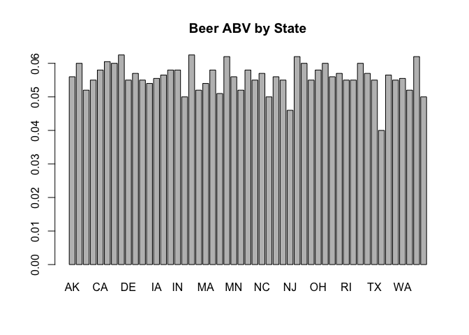
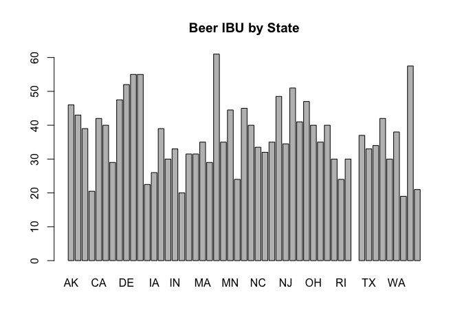
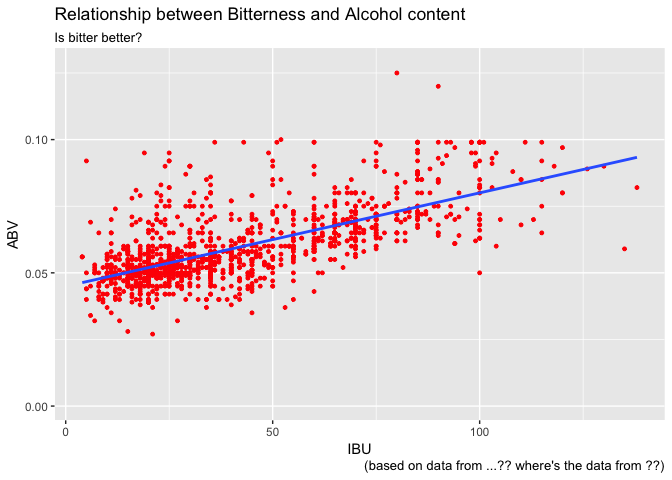

# BrewData Codebook ** Top Secret **
Jim Park & Randall Hendrickson  
October 13, 2017  


```r
knitr::opts_chunk$set(echo = FALSE)
if(!require("here")) cat("please install here package # devtools::install_github(\"krlmlr/here\")")
```

```
## Loading required package: here
```

```
## here() starts at /Users/randy/repos/datascience/caseStudy/branches/master/msds6306Case
```

```r
library(knitr)
library(here)
dataSetup_script <- here("scripts", "dataSetup.R")
analysis_script <- here("scripts", "analysis.R")
source(dataSetup_script)
```

```
## Loading required package: methods
```

```
## Loading required package: bitops
```

## BrewData Codebook - Classified
This codebook outlines the **"secret sauce"** for BrewData's technical apparatus.

read chunk = dataSetup_script.R


### 1. Script - **dataSetup.R**

uses the @ knitr variable pattern to read the following

- scriptDataSetup_files
- scriptDataSetup_readFiles
- scriptDataSetup_tidyBeersAndBreweries
- scriptDataSetup_logsessionInfo

#### 1. a. Locate the raw data files.

```r
library(RCurl)
library(here) # see note1 in script for explanation
# --- Raw data
local_file1 <- here("data", "Breweries.csv")
local_file2 <- here("data", "Beers.csv")
```
#### Result: 

```r
# the raw data files:
sprintf("This returns two files: %s , %s", local_file1, local_file2)
```

```
## [1] "This returns two files: /Users/randy/repos/datascience/caseStudy/branches/master/msds6306Case/data/Breweries.csv , /Users/randy/repos/datascience/caseStudy/branches/master/msds6306Case/data/Beers.csv"
```

#### 1. b. Read the data files

```r
script_breweries <- read.csv(paste(local_file1), header = TRUE, sep = ",")
script_beers <- read.csv(paste(local_file2), header = TRUE, sep = ",")
```
#### Result: 

```r
# This returns two data frames, beers and breweries
# structure of beers
str(script_beers)
```

```
## 'data.frame':	2410 obs. of  7 variables:
##  $ Name      : Factor w/ 2305 levels "#001 Golden Amber Lager",..: 1638 577 1704 1842 1819 268 1160 758 1093 486 ...
##  $ Beer_ID   : int  1436 2265 2264 2263 2262 2261 2260 2259 2258 2131 ...
##  $ ABV       : num  0.05 0.066 0.071 0.09 0.075 0.077 0.045 0.065 0.055 0.086 ...
##  $ IBU       : int  NA NA NA NA NA NA NA NA NA NA ...
##  $ Brewery_id: int  409 178 178 178 178 178 178 178 178 178 ...
##  $ Style     : Factor w/ 100 levels "","Abbey Single Ale",..: 19 18 16 12 16 80 18 22 18 12 ...
##  $ Ounces    : num  12 12 12 12 12 12 12 12 12 12 ...
```

```r
colnames(script_beers)
```

```
## [1] "Name"       "Beer_ID"    "ABV"        "IBU"        "Brewery_id"
## [6] "Style"      "Ounces"
```

```r
# structure of breweries
str(script_breweries)
```

```
## 'data.frame':	558 obs. of  4 variables:
##  $ Brew_ID: int  1 2 3 4 5 6 7 8 9 10 ...
##  $ Name   : Factor w/ 551 levels "10 Barrel Brewing Company",..: 355 12 266 319 201 136 227 477 59 491 ...
##  $ City   : Factor w/ 384 levels "Abingdon","Abita Springs",..: 228 200 122 299 300 62 91 48 152 136 ...
##  $ State  : Factor w/ 51 levels " AK"," AL"," AR",..: 24 18 20 5 5 41 6 23 23 23 ...
```

```r
colnames(script_breweries)
```

```
## [1] "Brew_ID" "Name"    "City"    "State"
```

#### 1. c. tidy the data

```r
# tidy the data
# 
# TODO - remove strange characters seen in dataframe, whitespace, view data, verify #001 Golden Amber Lager beer name
# from str(beer_world), also " AL", " AR", etc.

colnames(script_breweries)[1] <- "Brewery_id"
script_breweries$Name <- trimws(script_breweries$Name)
script_breweries$State <- trimws(script_breweries$State)
```
#### Result: tidy data

#### 1. d. Log sessionInfo

```
## R version 3.4.1 (2017-06-30)
## Platform: x86_64-apple-darwin16.7.0 (64-bit)
## Running under: macOS High Sierra 10.13
## 
## Matrix products: default
## BLAS: /System/Library/Frameworks/Accelerate.framework/Versions/A/Frameworks/vecLib.framework/Versions/A/libBLAS.dylib
## LAPACK: /System/Library/Frameworks/Accelerate.framework/Versions/A/Frameworks/vecLib.framework/Versions/A/libLAPACK.dylib
## 
## locale:
## [1] en_US.UTF-8/en_US.UTF-8/en_US.UTF-8/C/en_US.UTF-8/en_US.UTF-8
## 
## attached base packages:
## [1] methods   stats     graphics  grDevices utils     datasets  base     
## 
## other attached packages:
## [1] RCurl_1.95-4.8 bitops_1.0-6   knitr_1.17     here_0.1      
## [5] rmarkdown_1.6 
## 
## loaded via a namespace (and not attached):
##  [1] compiler_3.4.1  backports_1.1.1 magrittr_1.5    rprojroot_1.2  
##  [5] tools_3.4.1     htmltools_0.3.6 yaml_2.1.14     Rcpp_0.12.13   
##  [9] stringi_1.1.5   stringr_1.2.0   digest_0.6.12   evaluate_0.10.1
```


### 2. Script - **analysis.R**

uses the @ knitr variable pattern to read the following

- script_Analysis_Question1
- script_Analysis_Question2
- script_Analysis_Question3
- script_Analysis_Question4
- script_Analysis_Question5
- script_Analysis_Question6
- script_Analysis_Question7


read chunk = analysis.R


Questions:

#### 2.1 How many breweries are present in each state?

```r
# Q1
# 1. How many breweries are present in each state?

library(data.table)
library(dplyr)
```

```
## 
## Attaching package: 'dplyr'
```

```
## The following objects are masked from 'package:data.table':
## 
##     between, first, last
```

```
## The following objects are masked from 'package:stats':
## 
##     filter, lag
```

```
## The following objects are masked from 'package:base':
## 
##     intersect, setdiff, setequal, union
```

```r
library(ggplot2)

number_breweries_byState <- setDT(script_breweries)[, .(count = uniqueN(Brewery_id)), by = State]
setorder(number_breweries_byState, State)

# verify using dplyr
number_breweries_byState_dplyr <- script_breweries
number_breweries_byState_dplyr %>% group_by(State) %>% summarize(count=n()) %>% print(n = 100)
```

```
## # A tibble: 51 x 2
##    State count
##    <chr> <int>
##  1    AK     7
##  2    AL     3
##  3    AR     2
##  4    AZ    11
##  5    CA    39
##  6    CO    47
##  7    CT     8
##  8    DC     1
##  9    DE     2
## 10    FL    15
## 11    GA     7
## 12    HI     4
## 13    IA     5
## 14    ID     5
## 15    IL    18
## 16    IN    22
## 17    KS     3
## 18    KY     4
## 19    LA     5
## 20    MA    23
## 21    MD     7
## 22    ME     9
## 23    MI    32
## 24    MN    12
## 25    MO     9
## 26    MS     2
## 27    MT     9
## 28    NC    19
## 29    ND     1
## 30    NE     5
## 31    NH     3
## 32    NJ     3
## 33    NM     4
## 34    NV     2
## 35    NY    16
## 36    OH    15
## 37    OK     6
## 38    OR    29
## 39    PA    25
## 40    RI     5
## 41    SC     4
## 42    SD     1
## 43    TN     3
## 44    TX    28
## 45    UT     4
## 46    VA    16
## 47    VT    10
## 48    WA    23
## 49    WI    20
## 50    WV     1
## 51    WY     4
```
#### Result: 

```r
number_breweries_byState
```

```
##     State count
##  1:    AK     7
##  2:    AL     3
##  3:    AR     2
##  4:    AZ    11
##  5:    CA    39
##  6:    CO    47
##  7:    CT     8
##  8:    DC     1
##  9:    DE     2
## 10:    FL    15
## 11:    GA     7
## 12:    HI     4
## 13:    IA     5
## 14:    ID     5
## 15:    IL    18
## 16:    IN    22
## 17:    KS     3
## 18:    KY     4
## 19:    LA     5
## 20:    MA    23
## 21:    MD     7
## 22:    ME     9
## 23:    MI    32
## 24:    MN    12
## 25:    MO     9
## 26:    MS     2
## 27:    MT     9
## 28:    NC    19
## 29:    ND     1
## 30:    NE     5
## 31:    NH     3
## 32:    NJ     3
## 33:    NM     4
## 34:    NV     2
## 35:    NY    16
## 36:    OH    15
## 37:    OK     6
## 38:    OR    29
## 39:    PA    25
## 40:    RI     5
## 41:    SC     4
## 42:    SD     1
## 43:    TN     3
## 44:    TX    28
## 45:    UT     4
## 46:    VA    16
## 47:    VT    10
## 48:    WA    23
## 49:    WI    20
## 50:    WV     1
## 51:    WY     4
##     State count
```

#### 2.2 Merge beer data with the breweries data. Print the first 6 observations and the last six observations to check the merged file.

```r
# 2. Merge beer data with the brewery data.
# Q2
# merge beer data and brewery data. Print first and last 6 observations to check the merged file.

script_beer_world <- merge(script_beers, script_breweries, by = "Brewery_id")
names(script_beer_world)[names(script_beer_world) == "Name.x"] <- "Beer_Name"
names(script_beer_world)[names(script_beer_world) == "Name.y"] <- "Brewery_Name"
```
#### Result: 

```r
# print first 6 observations
head(script_beer_world, 6)
```

```
##   Brewery_id     Beer_Name Beer_ID   ABV IBU
## 1          1  Get Together    2692 0.045  50
## 2          1 Maggie's Leap    2691 0.049  26
## 3          1    Wall's End    2690 0.048  19
## 4          1       Pumpion    2689 0.060  38
## 5          1    Stronghold    2688 0.060  25
## 6          1   Parapet ESB    2687 0.056  47
##                                 Style Ounces      Brewery_Name        City
## 1                        American IPA     16 NorthGate Brewing Minneapolis
## 2                  Milk / Sweet Stout     16 NorthGate Brewing Minneapolis
## 3                   English Brown Ale     16 NorthGate Brewing Minneapolis
## 4                         Pumpkin Ale     16 NorthGate Brewing Minneapolis
## 5                     American Porter     16 NorthGate Brewing Minneapolis
## 6 Extra Special / Strong Bitter (ESB)     16 NorthGate Brewing Minneapolis
##   State
## 1    MN
## 2    MN
## 3    MN
## 4    MN
## 5    MN
## 6    MN
```

```r
# print last 6 observations
tail(script_beer_world, 6)
```

```
##      Brewery_id                 Beer_Name Beer_ID   ABV IBU
## 2405        556             Pilsner Ukiah      98 0.055  NA
## 2406        557  Heinnieweisse Weissebier      52 0.049  NA
## 2407        557           Snapperhead IPA      51 0.068  NA
## 2408        557         Moo Thunder Stout      50 0.049  NA
## 2409        557         Porkslap Pale Ale      49 0.043  NA
## 2410        558 Urban Wilderness Pale Ale      30 0.049  NA
##                        Style Ounces                  Brewery_Name
## 2405         German Pilsener     12         Ukiah Brewing Company
## 2406              Hefeweizen     12       Butternuts Beer and Ale
## 2407            American IPA     12       Butternuts Beer and Ale
## 2408      Milk / Sweet Stout     12       Butternuts Beer and Ale
## 2409 American Pale Ale (APA)     12       Butternuts Beer and Ale
## 2410        English Pale Ale     12 Sleeping Lady Brewing Company
##               City State
## 2405         Ukiah    CA
## 2406 Garrattsville    NY
## 2407 Garrattsville    NY
## 2408 Garrattsville    NY
## 2409 Garrattsville    NY
## 2410     Anchorage    AK
```

#### 2.3 Report the number of NA's in each column.

```r
# Q3
# Report the number of NS's in each column

num_NAs <- sapply(script_beer_world, function(x) sum(is.na(x)))
```
#### Result: 

```r
# report number of NAs
num_NAs
```

```
##   Brewery_id    Beer_Name      Beer_ID          ABV          IBU 
##            0            0            0           62         1005 
##        Style       Ounces Brewery_Name         City        State 
##            0            0            0            0            0
```

#### 2.4 Compute the median alcohol content and international bitterness unit for each state. Plot a bar chart to compare. 

```r
# Q4
# compute the median alcohol content and IBU for each state Plot a bar chart to compare

script_state_ABV <- aggregate(script_beer_world["ABV"], by=script_beer_world[c("State")], FUN=median, na.rm=TRUE)
barplot(script_state_ABV$ABV, main="Beer ABV by State", names.arg = script_state_ABV$State)
```

<!-- -->

```r
script_state_IBU <- aggregate(script_beer_world["IBU"], by=script_beer_world[c("State")], FUN=median, na.rm=TRUE)
barplot(script_state_IBU$IBU, main="Beer IBU by State", names.arg = script_state_IBU$State)
```

<!-- -->
#### Result: 


#### 2.5 Which state has the maximum alcoholic (ABV) beer? Which state has the most bitter (IBU) beer?

```r
# Q5
# Which state has the maximum alcoholic (ABV) beer? Which state has the most bitter (IBU) beer?

# max ABV
script_state_max_ABV <- script_state_ABV[which.max(script_state_ABV$ABV),]

# max IBU
script_state_max_IBU <- script_state_IBU[which.max(script_state_IBU$IBU),]
```
#### Result: 

```r
# max ABV
script_state_max_ABV
```

```
##   State    ABV
## 8    DC 0.0625
```

```r
# max ABV
script_state_max_IBU
```

```
##    State IBU
## 22    ME  61
```

#### 2.6 Summary statistics for the ABV variable.

```r
# Q6
# Summary statistics for the ABV variable.
summary(script_state_ABV)
```

```
##     State                ABV         
##  Length:51          Min.   :0.04000  
##  Class :character   1st Qu.:0.05500  
##  Mode  :character   Median :0.05600  
##                     Mean   :0.05585  
##                     3rd Qu.:0.05800  
##                     Max.   :0.06250
```
#### Result: 

```r
# printed summary of ABV
```

#### 2.7 Is there an apparent relationship between the bitterness of the beer and its alcoholic content? Draw a scatter plot. Make your best judgment of a relationship and EXPLAIN your answer.

```r
# Q7
# Is there an apparent relationship between the bitterness of the beer and its alcoholic content? Draw a scatter plot.

ggplot(script_beer_world, aes(x = IBU, y = ABV)) + 
  geom_point(colour = 'red', size = 1, na.rm=TRUE) + 
  labs(title = "Relationship between Bitterness and Alcohol content", subtitle = "Is bitter better?") + 
  labs(caption = "(based on data from ...?? where's the data from ??)") +
  geom_smooth(method=lm, se=FALSE, size = 1, na.rm=TRUE)
```

<!-- -->

```r
# TODO

# cat(paste("This is the state to analyze:", params$state))

#```{r child = './markdown/analysis.Rmd'}
#```

#```{r child = './markdown/customer.Rmd'}
#```
```
#### Result: 

```r
# Summary of relationship
```

