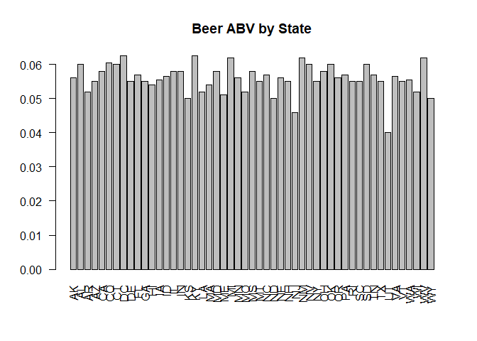
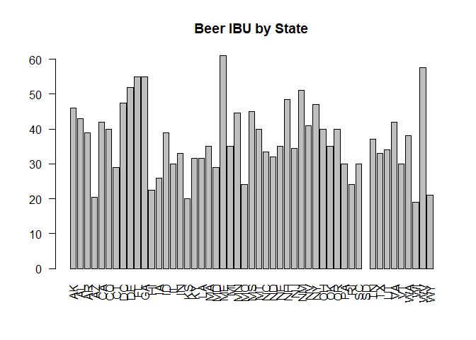
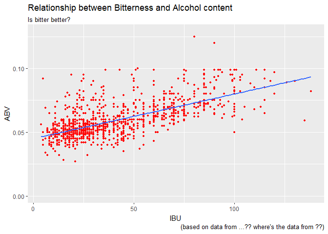
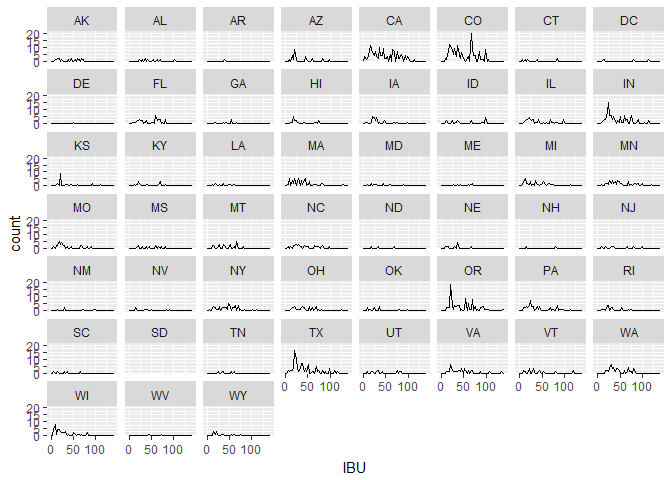
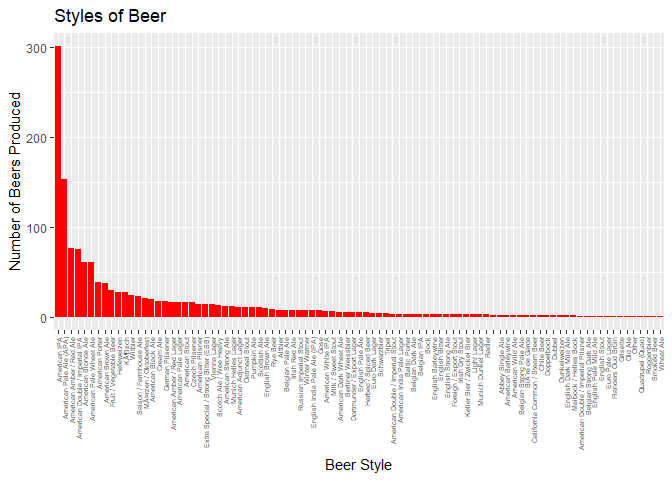

# BrewData Case Study 01 - Beers
Jim Park & Randall Hendrickson  
October 6, 2017  


```r
knitr::opts_chunk$set(echo = FALSE)
if(!require("here")) cat("please install here package # devtools::install_github(\"krlmlr/here\")")
```

```
## Loading required package: here
```

```
## here() starts at D:/dataScience/doingDS/case-study01/msds6306Case
```

```r
library(knitr)
library(here)
dataSetup_script <- here("scripts", "dataSetup.R")
analysis_script <- here("scripts", "analysis.R")
source(dataSetup_script)
```

```
## Loading required package: bitops
```

```r
#source(analysis_script)
```

#### Case Study 01

Beers

#### Questions


#### 1. How many breweries are present in each state?

```
## 
## Attaching package: 'dplyr'
```

```
## The following objects are masked from 'package:data.table':
## 
##     between, first, last
```

```
## The following objects are masked from 'package:stats':
## 
##     filter, lag
```

```
## The following objects are masked from 'package:base':
## 
##     intersect, setdiff, setequal, union
```

```
## # A tibble: 51 x 2
##    State count
##    <chr> <int>
##  1    AK     7
##  2    AL     3
##  3    AR     2
##  4    AZ    11
##  5    CA    39
##  6    CO    47
##  7    CT     8
##  8    DC     1
##  9    DE     2
## 10    FL    15
## 11    GA     7
## 12    HI     4
## 13    IA     5
## 14    ID     5
## 15    IL    18
## 16    IN    22
## 17    KS     3
## 18    KY     4
## 19    LA     5
## 20    MA    23
## 21    MD     7
## 22    ME     9
## 23    MI    32
## 24    MN    12
## 25    MO     9
## 26    MS     2
## 27    MT     9
## 28    NC    19
## 29    ND     1
## 30    NE     5
## 31    NH     3
## 32    NJ     3
## 33    NM     4
## 34    NV     2
## 35    NY    16
## 36    OH    15
## 37    OK     6
## 38    OR    29
## 39    PA    25
## 40    RI     5
## 41    SC     4
## 42    SD     1
## 43    TN     3
## 44    TX    28
## 45    UT     4
## 46    VA    16
## 47    VT    10
## 48    WA    23
## 49    WI    20
## 50    WV     1
## 51    WY     4
```


```r
number_breweries_byState
```

```
##     State count
##  1:    AK     7
##  2:    AL     3
##  3:    AR     2
##  4:    AZ    11
##  5:    CA    39
##  6:    CO    47
##  7:    CT     8
##  8:    DC     1
##  9:    DE     2
## 10:    FL    15
## 11:    GA     7
## 12:    HI     4
## 13:    IA     5
## 14:    ID     5
## 15:    IL    18
## 16:    IN    22
## 17:    KS     3
## 18:    KY     4
## 19:    LA     5
## 20:    MA    23
## 21:    MD     7
## 22:    ME     9
## 23:    MI    32
## 24:    MN    12
## 25:    MO     9
## 26:    MS     2
## 27:    MT     9
## 28:    NC    19
## 29:    ND     1
## 30:    NE     5
## 31:    NH     3
## 32:    NJ     3
## 33:    NM     4
## 34:    NV     2
## 35:    NY    16
## 36:    OH    15
## 37:    OK     6
## 38:    OR    29
## 39:    PA    25
## 40:    RI     5
## 41:    SC     4
## 42:    SD     1
## 43:    TN     3
## 44:    TX    28
## 45:    UT     4
## 46:    VA    16
## 47:    VT    10
## 48:    WA    23
## 49:    WI    20
## 50:    WV     1
## 51:    WY     4
##     State count
```

#### 2. Merge beer data with the brewery data.


```r
# print first 6 observations
head(script_beer_world, 6)
```

```
##   Brewery_id     Beer_Name Beer_ID   ABV IBU
## 1          1  Get Together    2692 0.045  50
## 2          1 Maggie's Leap    2691 0.049  26
## 3          1    Wall's End    2690 0.048  19
## 4          1       Pumpion    2689 0.060  38
## 5          1    Stronghold    2688 0.060  25
## 6          1   Parapet ESB    2687 0.056  47
##                                 Style Ounces      Brewery_Name        City
## 1                        American IPA     16 NorthGate Brewing Minneapolis
## 2                  Milk / Sweet Stout     16 NorthGate Brewing Minneapolis
## 3                   English Brown Ale     16 NorthGate Brewing Minneapolis
## 4                         Pumpkin Ale     16 NorthGate Brewing Minneapolis
## 5                     American Porter     16 NorthGate Brewing Minneapolis
## 6 Extra Special / Strong Bitter (ESB)     16 NorthGate Brewing Minneapolis
##   State
## 1    MN
## 2    MN
## 3    MN
## 4    MN
## 5    MN
## 6    MN
```

```r
# print last 6 observations
tail(script_beer_world, 6)
```

```
##      Brewery_id                 Beer_Name Beer_ID   ABV IBU
## 2405        556             Pilsner Ukiah      98 0.055  NA
## 2406        557  Heinnieweisse Weissebier      52 0.049  NA
## 2407        557           Snapperhead IPA      51 0.068  NA
## 2408        557         Moo Thunder Stout      50 0.049  NA
## 2409        557         Porkslap Pale Ale      49 0.043  NA
## 2410        558 Urban Wilderness Pale Ale      30 0.049  NA
##                        Style Ounces                  Brewery_Name
## 2405         German Pilsener     12         Ukiah Brewing Company
## 2406              Hefeweizen     12       Butternuts Beer and Ale
## 2407            American IPA     12       Butternuts Beer and Ale
## 2408      Milk / Sweet Stout     12       Butternuts Beer and Ale
## 2409 American Pale Ale (APA)     12       Butternuts Beer and Ale
## 2410        English Pale Ale     12 Sleeping Lady Brewing Company
##               City State
## 2405         Ukiah    CA
## 2406 Garrattsville    NY
## 2407 Garrattsville    NY
## 2408 Garrattsville    NY
## 2409 Garrattsville    NY
## 2410     Anchorage    AK
```

#### 3. Report the number of NS's in each column


```r
# report number of NAs
num_NAs
```

```
##   Brewery_id    Beer_Name      Beer_ID          ABV          IBU 
##            0            0            0           62         1005 
##        Style       Ounces Brewery_Name         City        State 
##            0            0            0            0            0
```

#### 4. Compute the median alcohol content and international bitterness unit for each state.

```r
# Q4
# compute the median alcohol content and IBU for each state Plot a bar chart to compare

script_state_ABV <- aggregate(script_beer_world["ABV"], by=script_beer_world[c("State")], FUN=median, na.rm=TRUE)
barplot(script_state_ABV$ABV, main="Beer ABV by State", names.arg = script_state_ABV$State, las=2)
```

<!-- -->

```r
script_state_IBU <- aggregate(script_beer_world["IBU"], by=script_beer_world[c("State")], FUN=median, na.rm=TRUE)
barplot(script_state_IBU$IBU, main="Beer IBU by State", names.arg = script_state_IBU$State, las=2)
```

<!-- -->

#### 5. Which state has the maximum alcoholic (ABV) beer? Which state has the most bitter (IBU) beer?


```r
# max ABV
script_state_max_ABV
```

```
##   State    ABV
## 8    DC 0.0625
```

```r
# max ABV
script_state_max_IBU
```

```
##    State IBU
## 22    ME  61
```

#### 6. Summary statistics for the ABV variable.

```r
# Q6
# Summary statistics for the ABV variable.
summary(script_state_ABV)
```

```
##     State                ABV         
##  Length:51          Min.   :0.04000  
##  Class :character   1st Qu.:0.05500  
##  Mode  :character   Median :0.05600  
##                     Mean   :0.05585  
##                     3rd Qu.:0.05800  
##                     Max.   :0.06250
```

#### 7. Is there an apparent relationship between the bitterness of the beer and its alcoholic content? Draw a scatter plot.

```r
# Q7
# Is there an apparent relationship between the bitterness of the beer and its alcoholic content? Draw a scatter plot.

ggplot(script_beer_world, aes(x = IBU, y = ABV)) + 
  geom_point(colour = 'red', size = 1, na.rm=TRUE) + 
  labs(title = "Relationship between Bitterness and Alcohol content", subtitle = "Is bitter better?") + 
  labs(caption = "(based on data from ...?? where's the data from ??)") +
  geom_smooth(method=lm, se=FALSE, size = 1, na.rm=TRUE)
```

<!-- -->

```r
# TODO

# cat(paste("This is the state to analyze:", params$state))

#```{r child = './markdown/analysis.Rmd'}
#```

#```{r child = './markdown/customer.Rmd'}
#```
```


```
## This is the state to analyze: TX
```


read chunk = dataSetup_script.R

```r
read_chunk(paste(dataSetup_script))
```

read chunk = analysis.R

```r
read_chunk(paste(analysis_script))
```


## Beer and Brewery Analysis


```r
summary(script_beer_world)
```

```
##    Brewery_id                     Beer_Name       Beer_ID      
##  Min.   :  1.0   Nonstop Hef Hop       :  12   Min.   :   1.0  
##  1st Qu.: 94.0   Dale's Pale Ale       :   6   1st Qu.: 808.2  
##  Median :206.0   Oktoberfest           :   6   Median :1453.5  
##  Mean   :232.7   Longboard Island Lager:   4   Mean   :1431.1  
##  3rd Qu.:367.0   1327 Pod's ESB        :   3   3rd Qu.:2075.8  
##  Max.   :558.0   Boston Lager          :   3   Max.   :2692.0  
##                  (Other)               :2376                   
##       ABV               IBU                                    Style     
##  Min.   :0.00100   Min.   :  4.00   American IPA                  : 424  
##  1st Qu.:0.05000   1st Qu.: 21.00   American Pale Ale (APA)       : 245  
##  Median :0.05600   Median : 35.00   American Amber / Red Ale      : 133  
##  Mean   :0.05977   Mean   : 42.71   American Blonde Ale           : 108  
##  3rd Qu.:0.06700   3rd Qu.: 64.00   American Double / Imperial IPA: 105  
##  Max.   :0.12800   Max.   :138.00   American Pale Wheat Ale       :  97  
##  NA's   :62        NA's   :1005     (Other)                       :1298  
##      Ounces      Brewery_Name                 City         State          
##  Min.   : 8.40   Length:2410        Grand Rapids:  66   Length:2410       
##  1st Qu.:12.00   Class :character   Portland    :  64   Class :character  
##  Median :12.00   Mode  :character   Chicago     :  55   Mode  :character  
##  Mean   :13.59                      Indianapolis:  43                     
##  3rd Qu.:16.00                      San Diego   :  42                     
##  Max.   :32.00                      Boulder     :  41                     
##                                     (Other)     :2099
```


### Breweries and IBU by state


```r
library(ggplot2)

# State to watch
state_to_watch <- params$state
state_to_watch
```

```
## [1] "TX"
```

```r
p <- ggplot(script_beer_world, aes(x = IBU)) + geom_freqpoly(binwidth = 3, na.rm = TRUE) + facet_wrap(~State)
p
```

<!-- -->

### Bitter beers


```r
# data sets
# script testing

library(ggplot2)

# use here package to help with project structure
# devtools::install_github("krlmlr/here")
library(here)

dataSetup_script <- here("scripts", "dataSetup.R")

source(dataSetup_script)

# Create a data set for bitterness
script_bitter_beers <- subset(script_beers,!(is.na(script_beers$IBU))) 

# Aggregate instances, IBU, ABV by style
script_instances <- table(script_bitter_beers$Style)
script_instances <- as.data.frame(script_instances)
script_instances <- subset(script_instances, script_instances$Freq > 0)

means1 <- aggregate(IBU~Style, script_bitter_beers, mean)
means2 <- aggregate(ABV~Style, script_bitter_beers, mean)
means3 <- script_instances$Freq

means1$ABV <- means2$ABV
means1$instance <- means3
means1 <- means1[order(-means1$instance),]

# top 10 style of beer
head(means1, n = 10)
```

```
##                             Style      IBU        ABV instance
## 16                   American IPA 67.63455 0.06480731      301
## 17        American Pale Ale (APA) 44.94118 0.05497386      153
## 5        American Amber / Red Ale 36.29870 0.05719481       77
## 12 American Double / Imperial IPA 93.32000 0.08769333       75
## 9             American Blonde Ale 20.98361 0.05014754       61
## 19        American Pale Wheat Ale 20.68852 0.04755738       61
## 21                American Porter 31.92308 0.06033333       39
## 10             American Brown Ale 29.89474 0.05784211       38
## 57         Fruit / Vegetable Beer 14.20000 0.05133333       30
## 61                     Hefeweizen 17.59259 0.05162963       27
```

```r
#reorder in order of instances
means1$Style <- factor(means1$Style, levels = means1$Style[order(-means1$instance)])

#bar plot of results
ggplot(data=means1, aes(x=Style, y=instance)) +
  geom_bar(stat="identity", fill="#ff0000") + xlab("Beer Style") + ylab("Number of Beers Produced") +
  ggtitle("Styles of Beer") + theme(axis.text.x = element_text(angle=90, vjust=.5, hjust = 1,size=5))
```

<!-- -->


## Information

From the above plot, we see the state of:

```r
# State to watch
state_to_watch <- params$state
state_to_watch
```

```
## [1] "TX"
```

Has some interesting data.


## Customer


## Demographics


## Reproducible Research

Include the session info, e.g. this document is produced with **knitr**. 
Here is the session info:


```r
print(sessionInfo(), locale=FALSE)
```

```
## R version 3.4.2 (2017-09-28)
## Platform: x86_64-w64-mingw32/x64 (64-bit)
## Running under: Windows 10 x64 (build 15063)
## 
## Matrix products: default
## 
## attached base packages:
## [1] stats     graphics  grDevices utils     datasets  methods   base     
## 
## other attached packages:
## [1] ggplot2_2.2.1       dplyr_0.7.4         data.table_1.10.4-1
## [4] RCurl_1.95-4.8      bitops_1.0-6        knitr_1.17         
## [7] here_0.1           
## 
## loaded via a namespace (and not attached):
##  [1] Rcpp_0.12.13     bindr_0.1        magrittr_1.5     munsell_0.4.3   
##  [5] colorspace_1.3-2 R6_2.2.2         rlang_0.1.2      plyr_1.8.4      
##  [9] stringr_1.2.0    tools_3.4.2      grid_3.4.2       gtable_0.2.0    
## [13] htmltools_0.3.6  lazyeval_0.2.0   yaml_2.1.14      rprojroot_1.2   
## [17] digest_0.6.12    assertthat_0.2.0 tibble_1.3.4     bindrcpp_0.2    
## [21] glue_1.1.1       evaluate_0.10.1  rmarkdown_1.6    labeling_0.3    
## [25] stringi_1.1.5    compiler_3.4.2   scales_0.5.0     backports_1.1.1 
## [29] pkgconfig_2.0.1
```


