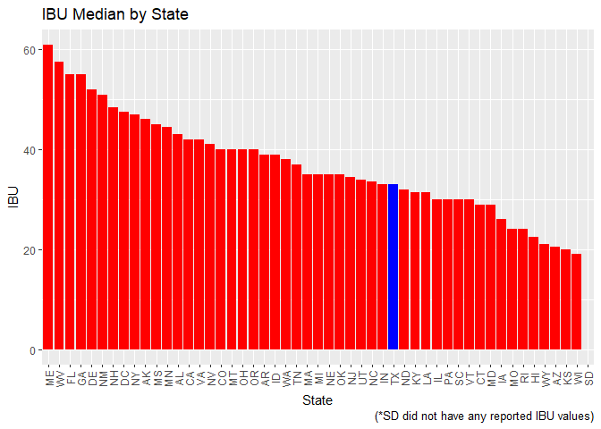
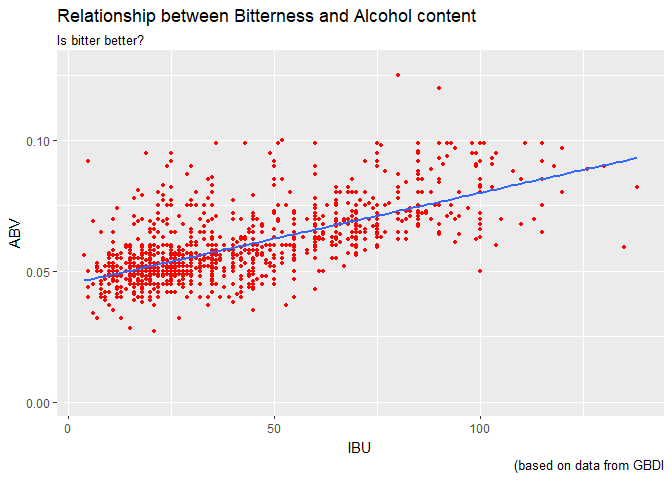
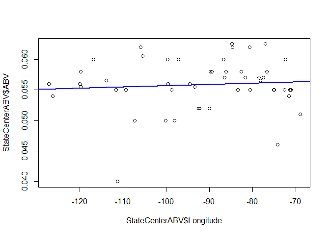
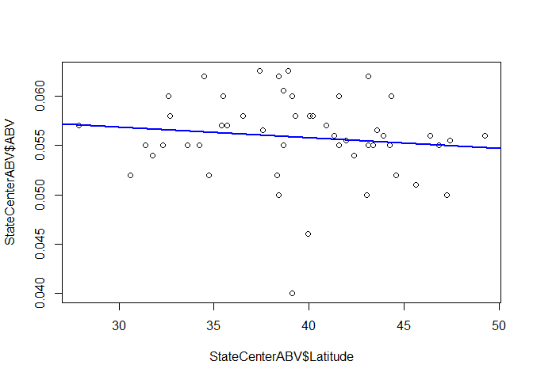

# Case Study 01 - Beers
Randall Hendrickson and Jim Park  
October 6, 2017  


```r
knitr::opts_chunk$set(echo = FALSE)
library(here)
```

```
## here() starts at D:/dataScience/doingDS/case-study01/msds6306Case
```

```r
data_functions_script <- here("scripts", "case_study_questions.R")
source(data_functions_script)
```

# INTRODUCTION

The number of breweries in the United States has more than tripled in the last decade according to www.brewersassociation.org.  Along with this explosive growth the industry is becoming much more competitive.   For startup breweries it is important to understand the level of competition within the state and the preferences of the consumer in order to be successful.  BrewData Inc., a data science company specializing in brewery and beer data, is pleased to provide our client, Great-Beer Distributors Inc. (GBDI), with an easy to use R program which reports out specific beer and brewery data of interested by the state as well as national trends.  As requested BrewData Inc. will conduct this work utilizing the data provided by GBDI.  Finally, GBDI has also asked BrewDAta Inc. to simplify the data provided by consolidating in to one merged data file and to identify missing data.

# CAPABILITIES AND DEMONSTRATION OF PROGRAM
To illustrate the program capabilites BrewData Inc. has provided sample program output using the state of Texas. To get additional reports for different states, change the state in *line 6* of the *Master_JP_RH.Rmd* document to another state, and run the *make* command at the project root directory, or use RStudio's *Build All* button. The program will provide a report specific to the state entered.  A sample report for the state of Texas, entered as 'TX', is provided below.

Here are specific responses as requested by our contract signed earlier. Please note, for the purpose of this report,  Washington D.C is modeled as a separate state.

1. As requested by GBDI, we have the following data for the number of breweries in each state. This will provide data whether their new brewery has local competition and by how many breweries.


```
##     State count
##  1:    AK     7
##  2:    AL     3
##  3:    AR     2
##  4:    AZ    11
##  5:    CA    39
##  6:    CO    47
##  7:    CT     8
##  8:    DC     1
##  9:    DE     2
## 10:    FL    15
## 11:    GA     7
## 12:    HI     4
## 13:    IA     5
## 14:    ID     5
## 15:    IL    18
## 16:    IN    22
## 17:    KS     3
## 18:    KY     4
## 19:    LA     5
## 20:    MA    23
## 21:    MD     7
## 22:    ME     9
## 23:    MI    32
## 24:    MN    12
## 25:    MO     9
## 26:    MS     2
## 27:    MT     9
## 28:    NC    19
## 29:    ND     1
## 30:    NE     5
## 31:    NH     3
## 32:    NJ     3
## 33:    NM     4
## 34:    NV     2
## 35:    NY    16
## 36:    OH    15
## 37:    OK     6
## 38:    OR    29
## 39:    PA    25
## 40:    RI     5
## 41:    SC     4
## 42:    SD     1
## 43:    TN     3
## 44:    TX    28
## 45:    UT     4
## 46:    VA    16
## 47:    VT    10
## 48:    WA    23
## 49:    WI    20
## 50:    WV     1
## 51:    WY     4
##     State count
```

2. Additional information requested by GBDI was related to the beers that these respective brewers produce. We have consolidated this data by merging the data for the beers produced by each brewer. As requested, here are the first and last six observations for this data. A printing of the first 6 observations and the last 6 observations are provided here as a sample of the output.


```
##   Brewery_id     Beer_Name Beer_ID   ABV IBU
## 1          1  Get Together    2692 0.045  50
## 2          1 Maggie's Leap    2691 0.049  26
## 3          1    Wall's End    2690 0.048  19
## 4          1       Pumpion    2689 0.060  38
## 5          1    Stronghold    2688 0.060  25
## 6          1   Parapet ESB    2687 0.056  47
##                                 Style Ounces      Brewery_Name        City
## 1                        American IPA     16 NorthGate Brewing Minneapolis
## 2                  Milk / Sweet Stout     16 NorthGate Brewing Minneapolis
## 3                   English Brown Ale     16 NorthGate Brewing Minneapolis
## 4                         Pumpkin Ale     16 NorthGate Brewing Minneapolis
## 5                     American Porter     16 NorthGate Brewing Minneapolis
## 6 Extra Special / Strong Bitter (ESB)     16 NorthGate Brewing Minneapolis
##   State
## 1    MN
## 2    MN
## 3    MN
## 4    MN
## 5    MN
## 6    MN
```

```
##      Brewery_id                 Beer_Name Beer_ID   ABV IBU
## 2405        556             Pilsner Ukiah      98 0.055  NA
## 2406        557  Heinnieweisse Weissebier      52 0.049  NA
## 2407        557           Snapperhead IPA      51 0.068  NA
## 2408        557         Moo Thunder Stout      50 0.049  NA
## 2409        557         Porkslap Pale Ale      49 0.043  NA
## 2410        558 Urban Wilderness Pale Ale      30 0.049  NA
##                        Style Ounces                  Brewery_Name
## 2405         German Pilsener     12         Ukiah Brewing Company
## 2406              Hefeweizen     12       Butternuts Beer and Ale
## 2407            American IPA     12       Butternuts Beer and Ale
## 2408      Milk / Sweet Stout     12       Butternuts Beer and Ale
## 2409 American Pale Ale (APA)     12       Butternuts Beer and Ale
## 2410        English Pale Ale     12 Sleeping Lady Brewing Company
##               City State
## 2405         Ukiah    CA
## 2406 Garrattsville    NY
## 2407 Garrattsville    NY
## 2408 Garrattsville    NY
## 2409 Garrattsville    NY
## 2410     Anchorage    AK
```

3. As requested by GBDI, we are pleased to perform robustness tests on the produced data. We have identified some missing data as detailed below. This is represented by an "NA" term and the counts are detailed below. The chart below shows there are 62 NAs in Alcohol by Volume (ABV) and there are 1005 NAs in International Bitterness Unit data. Both were from data sets provided by GBDI. It should be noted that South Dakota did not have any reported IBU data. (For an additional fee, we can provide testing for all missing NA data or provide state of the art bootstrapping techniques.)


```
##   Brewery_id    Beer_Name      Beer_ID          ABV          IBU 
##            0            0            0           62         1005 
##        Style       Ounces Brewery_Name         City        State 
##            0            0            0            0            0
```

4. After speaking with GBDI's *Brewmaster Mr. Potterhead*, we are well aware of the need to understand the ABV and IBU medians from the provided data. We are pleased to provide *Mr. Potterhead* with the following results and he should note that the report is customized to highlight The State of Texas in *Blue* as defined in our contract.


```
## 
## Attaching package: 'plyr'
```

```
## The following object is masked from 'package:here':
## 
##     here
```

<!-- -->

Additionally, after deep analysis, we are able to provide which state has the maximum alcoholic (ABV) beer and which state has the most bitter (IBU) beer. Please find the following data for your reference.

The state with the highest (max) median ABV is District of Columbia (DC).
The state with the highest (max) median IBU is Maine (ME).


```
##   State    ABV
## 8    DC 0.0625
```

```
##    State IBU
## 22    ME  61
```

6. Following the last sections of our contract, we are providing a summary of the ABV data, this summary includes the data from the output below.


```
##     State                ABV         
##  Length:51          Min.   :0.04000  
##  Class :character   1st Qu.:0.05500  
##  Mode  :character   Median :0.05600  
##                     Mean   :0.05585  
##                     3rd Qu.:0.05800  
##                     Max.   :0.06250
```

7. Finally, GBDi requested us to understand the relationship between the bitterness of the beer and its alcoholic content? Please see the below scatter plot. You will see there is a somewhat linear trend whereas IBU increases, so does ABV. Please note, that this is an observational study so causation cannot be inferred.

<!-- -->

In addition to the information requested under contract BrewData Inc. strives to exceed our customers expectations.  We hope you find the following information useful in understanding beer adn brewery trends in the selected state and in the nation in general.  The queries the data provided and lists all of the beers in a particular state (in this case Texas) along with a custom statement.  This data may be useful in understanding the level of competition in your state as well as an indication of which states are "Brew Friendly."  Please note that the data below is simply the first ten beers and only the last 5 columns due to space considerations.


```
## [1] "There are 51  Unique states in this data set and 130 unique beers in the state of TX"
```

```
##     IBU                          Style Ounces              Brewery_Name
## 226  90 American Double / Imperial IPA     16       Cedar Creek Brewery
## 227  NA                                    16       Cedar Creek Brewery
## 228  70                   American IPA     16       Cedar Creek Brewery
## 229  35                    Smoked Beer     16       Cedar Creek Brewery
## 230  36        American Pale Ale (APA)     16       Cedar Creek Brewery
## 231  18                      Cream Ale     16       Cedar Creek Brewery
## 283  26     American Amber / Red Lager     12 Twisted X Brewing Company
## 284  63                   American IPA     12 Twisted X Brewing Company
## 285  19         American Adjunct Lager     12 Twisted X Brewing Company
## 455  27                                    12  Freetail Brewing Company
##                 City State
## 226     Seven Points    TX
## 227     Seven Points    TX
## 228     Seven Points    TX
## 229     Seven Points    TX
## 230     Seven Points    TX
## 231     Seven Points    TX
## 283 Dripping Springs    TX
## 284 Dripping Springs    TX
## 285 Dripping Springs    TX
## 455      San Antonio    TX
```

Finally, BrewData Inc. has provided sample output for our patent pending regional ABV preference algorithm.   This tool assesses if there is a correlation between ABV and longitude and latitude as measured by the center of each state.   In both cases the correlation was relatively weak (less than 13%) with p values of 0.5737 (Longitude) and 0.3861 (Latitude).   Although the correlations are week, With additional contract work we could explore similar trends that your prime competitor seems to be leveraging fairly well.

# A Look at possible correlation between longitude and ABV
<!-- -->

```
## 
## 	Pearson's product-moment correlation
## 
## data:  StateCenterABV$Longitude and StateCenterABV$ABV
## t = 0.5664, df = 49, p-value = 0.5737
## alternative hypothesis: true correlation is not equal to 0
## 95 percent confidence interval:
##  -0.1993641  0.3484888
## sample estimates:
##        cor 
## 0.08065061
```

# A Look at possible correlation between latitude and ABV
<!-- -->

# CONCLUSION
BrewData Inc. has concluded that the beer industry is in a high growth mode in both ABV and IBU.  We have provided valuable data regarding national and state trends and the ability to customize reports based on the state desired.   Based on our most recently developed correlation tools there are many other areas to discover valuable information regarding the beer industry.   Please see the markdown directory provided in the Github repository for additional case studies, alternate tools and technology and customer scenarios that we would be pleased to utilize in our next project.  Also in the markdown directory you will find a "Master_JP_RH_Version2.Rmd" file witch is a condensed version where scripts are conveniently called versus imbedded.   This will provide a convenient method to integrat with the provided analytics 'engine'.  We would be pleased to collect and leverage further data in defining a profitable niche for your next super beer.  For addition reference please see the codebook.Rmd file contained in the root directory of this repository.

## Cheers, R. Hendrickson (Chief Beer Officer) and J. Park (Chief Data Officer) **


